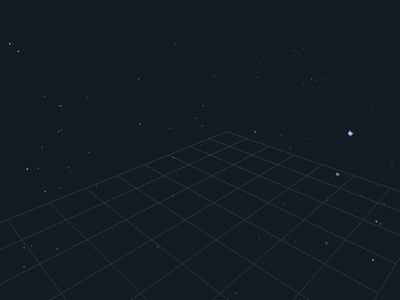

# Murmuration — Bird Flock Simulation

A Python simulation of starling murmurations implementing **two distinct flocking algorithms**, switchable at runtime:

| Mode | Algorithm | Inspiration |
|------|-----------|------------|
| **PROJECTION** | Hybrid projection model | [Pearce et al. (2014)](#references) |
| **SPATIAL** | Topological Reynolds boids | [Reynolds (1987)](#references) + [Ballerini et al. (2008)](#references) |

---

## Table of Contents

- [Quick Start](#quick-start)
- [Runtime Controls](#runtime-controls)
- [Algorithms](#algorithms)
  - [MODE 0 — Hybrid Projection Model](#mode-0--hybrid-projection-model)
  - [MODE 1 — Topological Reynolds Boids](#mode-1--topological-reynolds-boids)
- [Scientific Metrics](#scientific-metrics)
- [References](#references)
- [Step-by-Step Build Guide](#step-by-step-build-guide)
  - [Iteration 1 — Single Boid](#iteration-1--single-boid)
  - [Iteration 2 — Classic Reynolds Boids](#iteration-2--classic-reynolds-boids)
  - [Iteration 3 — Spatial Hash Grid](#iteration-3--spatial-hash-grid)
  - [Iteration 4 — Angular Occlusion Geometry](#iteration-4--angular-occlusion-geometry)
  - [Iteration 5 — Projection Model](#iteration-5--projection-model)
  - [Iteration 6 — Dual-Mode Flocking](#iteration-6--dual-mode-flocking)
  - [Iteration 7 — Scientific Metrics](#iteration-7--scientific-metrics)
  - [Iteration 8 — Boundary Modes](#iteration-8--boundary-modes)
  - [Iteration 9 — Modular Architecture](#iteration-9--modular-architecture)
- [3D Simulation Build Guide](#3d-simulation-build-guide)
  - [Iteration 10 — 3D Spatial Grid](#iteration-10--3d-spatial-grid)
  - [Iteration 11 — 3D Boid Agent](#iteration-11--3d-boid-agent)
  - [Iteration 12 — GPU Instanced Rendering](#iteration-12--gpu-instanced-rendering)
  - [Iteration 13 — 3D Main Loop](#iteration-13--3d-main-loop)
- [File Structure](#file-structure)

---

## Quick Start

### 2D (Pygame)

```bash
pip install pygame
python alg2.py
```

Press **`M`** to toggle between modes, **`H`** for a help overlay.

### 3D (ModernGL)

```bash
pip install pygame moderngl PyGLM numpy
python main_3d.py
```

Mouse drag to orbit camera, scroll to zoom, **`M`** to toggle mode.

---

## Runtime Controls

| Key | Action |
|-----|--------|
| `M` | Toggle **PROJECTION** ↔ **SPATIAL** mode |
| `↑` / `↓` | φp ±0.01 *(projection weight in mode 0, separation weight in mode 1)* |
| `←` / `→` | φa ±0.01 *(alignment weight; φn = 1 − φp − φa is auto-computed)* |
| `[` / `]` | σ ±1 *(nearest-neighbour count)* |
| `+` / `-` | Add / remove 10 birds |
| `G` | Toggle spatial grid overlay *(SPATIAL mode only)* |
| `H` | Toggle help overlay |
| `SPACE` | Pause / resume |
| `R` | Reset flock |
| `ESC` | Quit |

### 3D Controls

| Key / Mouse | Action |
|-------------|--------|
| `M` | Toggle **PROJECTION** ↔ **SPATIAL** mode |
| `↑` / `↓` | φp ±0.01 |
| `←` / `→` | φa ±0.01 |
| `[` / `]` | σ ±1 |
| `+` / `-` | Add / remove 10 birds |
| `G` | Toggle grid overlay |
| `SPACE` | Pause / resume |
| `R` | Reset flock |
| `ESC` | Quit |
| **Mouse drag** | Orbit camera |
| **Scroll** | Zoom in/out |

---

## Algorithms

### MODE 0 — Hybrid Projection Model

Based on the 2014 PNAS paper by **Pearce, Miller, Rowlands & Turner**:  
*"Role of projection in the control of bird flocks"*  
PNAS 111(29), 10422–10426 · [DOI: 10.1073/pnas.1402202111](https://doi.org/10.1073/pnas.1402202111)

#### Core Idea

The paper proposes that birds in large flocks do **not** track the positions of hundreds of neighbours. Instead, each bird perceives the flock as a pattern of **dark silhouettes against the sky** — a lower-dimensional projection of the full 6N-dimensional phase space. The bird responds to the boundaries between light (sky) and dark (bird) regions in its visual field.

This contrasts with classic Reynolds boids (implemented in `alg.py`), which use metric-based neighbour rules. The key difference: the **projection term replaces the classic separation and cohesion forces** with a single force derived from the bird's entire view.

#### The Velocity Equation (Eq. 3 from the paper)

```
v(t+1)_i  =  φp · δ̂_i   +   φa · ⟨v̂_k⟩_{vis.n.n.}   +   φn · η̂_i

where:
  δ̂_i   = normalised average direction to all light-dark domain boundaries
  ⟨..⟩  = average over the σ nearest *visible* neighbours
  η̂_i   = uncorrelated random noise (unit vector)
  φp + φa + φn = 1
```

Here is the exact implementation in `Boid._flock_projection()`:

```python
# 1 ─── projection direction & visible neighbours ──────────
delta, visible, theta = self._compute_projection_and_visibility(boids)
self._last_theta = theta

# 2 ─── alignment with σ nearest visible neighbours ────────
align = pygame.Vector2(0, 0)
if visible:
    nearest = visible[:config.sigma]
    for nb, _ in nearest:
        align += nb.velocity
    align /= len(nearest)

# 3 ─── noise ──────────────────────────────────────────────
na = random.uniform(0, 2 * math.pi)
noise = pygame.Vector2(math.cos(na), math.sin(na))

# 4 ─── desired direction  v = φp·δ̂ + φa·⟨v̂⟩ + φn·η̂ ──────
desired = delta * config.phi_p
if align.length() > 0.001:
    desired += align.normalize() * config.phi_a
else:
    if self.velocity.length() > 0.001:
        desired += self.velocity.normalize() * config.phi_a
desired += noise * config.phi_n

if desired.length() < 0.001:
    desired = pygame.Vector2(random.uniform(-1, 1), random.uniform(-1, 1))

# Normalise to constant speed for smooth animation
desired.normalize_ip()
desired *= V0

# 5 ─── Reynolds-style steering ────────────────────────────
steer = desired - self.velocity
if steer.length() > MAX_FORCE:
    steer.scale_to_length(MAX_FORCE)
self.apply_force(steer)
```

#### Computing δ̂ — The Projection Direction

The projection direction δ̂ is the average of unit vectors pointing to every **domain boundary** — the edges between light (visible sky) and dark (bird silhouettes) in the bird's view.

For each other bird `j` at distance `d`:

```
centre angle  = atan2(y_j − y_i,  x_j − x_i)
half-width    = arcsin(b / d)           # angular radius subtended by bird j
interval      = [centre − half,  centre + half]
```

After merging all intervals (closest birds first, to handle occlusion), the domain boundaries are the start and end of each merged interval:

```python
def _compute_projection_and_visibility(self, boids):
    entries = []  # (boid, distance, centre_angle, half_width)
    for other in boids:
        if other is self:
            continue
        diff = other.position - self.position
        dist = diff.length()
        if dist < 0.001:
            continue
        centre = math.atan2(diff.y, diff.x)
        if centre < 0:
            centre += 2 * math.pi
        half = math.asin(min(BOID_SIZE / dist, 1.0))
        entries.append((other, dist, centre, half))

    entries.sort(key=lambda x: x[1])  # closest first

    merged = []              # [[start, end], …]  in [0, 2π)
    visible_neighbours = []  # [(boid, distance), …]

    for other, dist, centre, half in entries:
        start = centre - half
        end   = centre + half
        segments = _normalise_interval(start, end)

        # A bird is visible iff its interval extends the occluded set
        is_visible = any(
            not _interval_covered(s, e, merged) for s, e in segments
        )
        if is_visible:
            visible_neighbours.append((other, dist))
            for s, e in segments:
                _merge_interval(s, e, merged)

    # δ̂ from domain boundaries: average unit vector to each boundary
    delta = pygame.Vector2(0, 0)
    for s, e in merged:
        delta += pygame.Vector2(math.cos(s), math.sin(s))
        delta += pygame.Vector2(math.cos(e), math.sin(e))

    # Fully surrounded → no projection information
    if (len(merged) == 1 and
            merged[0][0] < 1e-9 and
            merged[0][1] > 2 * math.pi - 1e-9):
        delta = pygame.Vector2(0, 0)

    if delta.length() > 0:
        delta.normalize_ip()

    # Internal opacity Θ_i
    occluded = sum(e - s for s, e in merged)
    theta = min(occluded / (2 * math.pi), 1.0)

    return delta, visible_neighbours, theta
```

Key detail: sorting by distance (closest first) before merging intervals ensures correct occlusion — closer birds block farther ones. A bird whose angular interval is completely covered by intervals from closer birds is considered **not visible** and excluded from the alignment term.

#### Angular Interval Merging

The simulation normalises intervals into the [0, 2π) range, handling wrap-around across the 0/2π boundary:

```python
def _normalise_interval(start: float, end: float) -> list:
    """Split an angular interval into [0, 2π) segments, handling wrap."""
    segments = []
    if start < 0:
        segments.append((start + 2 * math.pi, 2 * math.pi))
        segments.append((0, end))
    elif end > 2 * math.pi:
        segments.append((start, 2 * math.pi))
        segments.append((0, end - 2 * math.pi))
    else:
        segments.append((start, end))
    return segments
```

Intervals are merged using binary-search insertion for O(log K) per insert, then merging with at most two adjacent intervals:

```python
def _merge_interval(start: float, end: float, merged: list):
    """Binary-search insertion + merge with adjacent intervals."""
    n = len(merged)
    lo, hi = 0, n
    while lo < hi:
        mid = (lo + hi) // 2
        if merged[mid][0] < start:
            lo = mid + 1
        else:
            hi = mid
    idx = lo

    merged.insert(idx, [start, end])

    # merge left
    if idx > 0 and merged[idx - 1][1] >= merged[idx][0] - 1e-9:
        merged[idx - 1][1] = max(merged[idx - 1][1], merged[idx][1])
        merged.pop(idx)
        idx -= 1

    # merge right (chain in case of multiple overlaps)
    while idx < len(merged) - 1 and merged[idx][1] >= merged[idx + 1][0] - 1e-9:
        merged[idx][1] = max(merged[idx][1], merged[idx + 1][1])
        merged.pop(idx + 1)
```

---

### MODE 1 — Topological Reynolds Boids

A modernised version of Craig Reynolds' classic 1987 boids algorithm, incorporating:

- **Topological** (fixed neighbour count) rather than **metric** (fixed radius) neighbourhoods, following [Ballerini et al. (2008)](#references) who found starlings track exactly 6–7 neighbours regardless of distance
- **Spatial hash grid** optimisation for O(N) neighbour queries instead of O(N²)

#### Classic Reynolds Rules

The three rules from Reynolds (1987) "Flocks, Herds, and Schools":

```
Separation:  steer away from neighbours that are too close
Alignment:   steer toward the average heading of neighbours
Cohesion:    steer toward the average position of neighbours
```

#### Topological Neighbour Selection

Unlike `alg.py` (which uses all neighbours within a fixed `VISUAL_RANGE`), the SPATIAL mode selects only the **σ nearest neighbours**, mirroring starling behaviour:

```python
def _flock_spatial(self, boids, config, grid):
    # Query spatial grid for candidates (not all N birds)
    candidates = grid.get_nearby(self.position, VISUAL_RANGE)

    # Filter by exact distance, sort, take σ nearest
    neighbours = []
    for other in candidates:
        if other is self:
            continue
        d = self.position.distance_to(other.position)
        if d < VISUAL_RANGE:
            neighbours.append((other, d))
    neighbours.sort(key=lambda x: x[1])
    neighbours = neighbours[:config.sigma]  # topological cutoff
    n = len(neighbours)

    separation = pygame.Vector2(0, 0)
    alignment  = pygame.Vector2(0, 0)
    cohesion   = pygame.Vector2(0, 0)

    if n > 0:
        for other, d in neighbours:
            alignment += other.velocity
            cohesion  += other.position

            # Separation only when too close (< 30% of visual range)
            if d < VISUAL_RANGE * 0.3:
                diff = self.position - other.position
                if d > 0.001:
                    diff /= d
                separation += diff

        alignment /= n
        cohesion  /= n

        # Steering forces: desired minus current, clamped
        if alignment.length() > 0.001:
            alignment.scale_to_length(V0)
        alignment -= self.velocity
        if alignment.length() > MAX_FORCE:
            alignment.scale_to_length(MAX_FORCE)

        if cohesion.length() > 0.001:
            cohesion.scale_to_length(V0)
        cohesion -= self.velocity
        if cohesion.length() > MAX_FORCE:
            cohesion.scale_to_length(MAX_FORCE)

        if separation.length() > 0.001:
            separation.scale_to_length(V0)
        separation -= self.velocity
        if separation.length() > MAX_FORCE:
            separation.scale_to_length(MAX_FORCE)

    # Noise for exploration
    na = random.uniform(0, 2 * math.pi)
    noise = pygame.Vector2(math.cos(na), math.sin(na)) * MAX_FORCE * 0.8

    # Weighted sum
    self.apply_force(separation * config.phi_p * 2.0)
    self.apply_force(alignment  * config.phi_a * 1.2)
    self.apply_force(cohesion   * config.phi_n * 1.5)
    self.apply_force(noise)
```

#### Spatial Hash Grid

The spatial grid divides the simulation area into cells and maps each cell to the birds inside it. Neighbour queries then only examine cells overlapping the search radius — not all N birds.

```python
class SpatialGrid:
    def __init__(self, cell_size=70):
        self.cell_size = cell_size
        self.cols = max(1, int(math.ceil(WIDTH  / cell_size)))
        self.rows = max(1, int(math.ceil(HEIGHT / cell_size)))
        self.cells = defaultdict(list)

    def rebuild(self, boids):
        """Clear and repopulate in O(N)."""
        self.cells.clear()
        for boid in boids:
            cx = int(boid.position.x // self.cell_size) % self.cols
            cy = int(boid.position.y // self.cell_size) % self.rows
            self.cells[(cx, cy)].append(boid)

    def get_nearby(self, position, radius):
        """Return boids in cells overlapping the AABB of *radius*."""
        cx0 = int((position.x - radius) // self.cell_size)
        cx1 = int((position.x + radius) // self.cell_size)
        cy0 = int((position.y - radius) // self.cell_size)
        cy1 = int((position.y + radius) // self.cell_size)

        nearby = []
        for cx in range(cx0, cx1 + 1):
            wcx = cx % self.cols       # toroidal wrap
            for cy in range(cy0, cy1 + 1):
                wcy = cy % self.rows   # toroidal wrap
                nearby.extend(self.cells.get((wcx, wcy), ()))
        return nearby
```

The grid uses **toroidal (wrap-around) indexing** so birds near opposite screen edges can still interact — the simulation has periodic boundary conditions.

---

## Scientific Metrics

The simulation tracks three metrics from the Pearce et al. paper in real time:

| Metric | Symbol | Definition | Computation |
|--------|--------|------------|-------------|
| **Internal opacity** | Θ | Average fraction of each bird's 2π field of view occluded by other birds | Exact in PROJECTION mode (from already-computed intervals); sampled from 5 birds in SPATIAL mode |
| **External opacity** | Θ′ | Fraction of sky obscured from a distant external observer | O(N log N) interval merge from a fixed viewpoint |
| **Order parameter** | α | \|Σ vᵢ\| / (N · v₀) — degree of flock alignment (0 = chaotic, 1 = perfectly aligned) | O(N) sum of velocity vectors |

The paper predicts that flocks self-organise to a state of **marginal opacity** — Θ ≈ 0.25–0.60, neither fully transparent nor fully opaque. This is an emergent property of the projection model and does not require parameter tuning as flock size changes.

---

## References

1. **Pearce, D. J. G., Miller, A. M., Rowlands, G., & Turner, M. S.** (2014).  
   *"Role of projection in the control of bird flocks."*  
   Proceedings of the National Academy of Sciences, 111(29), 10422–10426.  
   [DOI: 10.1073/pnas.1402202111](https://doi.org/10.1073/pnas.1402202111)  
   *Proposes the hybrid projection model — the basis for MODE 0 (PROJECTION).*

2. **Reynolds, C. W.** (1987).  
   *"Flocks, Herds, and Schools: A Distributed Behavioral Model."*  
   ACM SIGGRAPH Computer Graphics, 21(4), 25–34.  
   [DOI: 10.1145/37402.37406](https://doi.org/10.1145/37402.37406)  
   *The original boids algorithm — the basis for MODE 1 (SPATIAL).*

3. **Ballerini, M., et al.** (2008).  
   *"Interaction ruling animal collective behavior depends on topological rather than metric distance: Evidence from a field study."*  
   Proceedings of the National Academy of Sciences, 105(4), 1232–1237.  
   [DOI: 10.1073/pnas.0711437105](https://doi.org/10.1073/pnas.0711437105)  
   *Empirical finding that starlings track 6–7 nearest neighbours regardless of distance — motivates topological (fixed-σ) rather than metric (fixed-radius) neighbourhoods.*

4. **Ballerini, M., et al.** (2008).  
   *"Empirical investigation of starling flocks: A benchmark study in collective animal behavior."*  
   Animal Behaviour, 76, 201–215.  
   [DOI: 10.1016/j.anbehav.2008.02.004](https://doi.org/10.1016/j.anbehav.2008.02.004)

---

## Step-by-Step Build Guide

This guide walks you from a single moving dot to the full modular simulation in 9 iterations.
Each iteration introduces one new concept and has a corresponding example file in the `examples/` directory.
Iterations 1–6 are complete, runnable Pygame simulations; iterations 7–9 are reference modules meant to be
imported into a running simulation (see the full codebase in the project root for the integrated version).

Run iterations 1–6 with:

```bash
pip install pygame
python examples/iteration{1-9}_{name}.py
```

### Iteration 1 — Single Boid

**File:** `examples/iteration1_single_boid.py`

**What we build:** A single bird moving across the screen with toroidal boundary wrap.

**New concepts:**

| Concept | How it works |
|---------|-------------|
| **Euler integration** | `velocity += acceleration`, `position += velocity` — the simplest numerical integration method |
| **Speed clamping** | `if speed > V0: scale_to_length(V0)` — prevents infinite acceleration; `if speed < V0 * 0.3` — prevents freezing |
| **Toroidal wrap** | `if x > WIDTH: x = 0` — re-enter from opposite edge, creating an infinite periodic universe |
| **Pygame basics** | `init()` → `set_mode()` → event loop → `display.flip()` → `clock.tick(FPS)` |
| **Triangle rendering** | Draw a triangle pointing in the direction of velocity using `atan2` |

**Key code pattern — the game loop:**

```python
running = True
while running:
    # 1. Handle input
    for event in pygame.event.get():
        if event.type == pygame.QUIT:
            running = False

    # 2. Update physics
    position += velocity
    # ... toroidal wrap ...

    # 3. Render
    screen.fill((20, 22, 30))
    draw_boid(screen, position, velocity)
    pygame.display.flip()
    clock.tick(FPS)
```

This 1-2-3 pattern (input → update → render) is the same structure used throughout the entire project. Everything else is just *more stuff inside step 2*.

> **What's next?** Continue to [Iteration 2 — Classic Reynolds Boids](#iteration-2--classic-reynolds-boids)
> (`examples/iteration2_reynolds_boids.py`) to learn how three simple steering rules —
> separation, alignment, and cohesion — create lifelike flock movement from multiple birds.

---

### Iteration 2 — Classic Reynolds Boids

**File:** `examples/iteration2_reynolds_boids.py`

**What we build:** Multiple birds with three classic steering forces — separation, alignment, and cohesion.

**New concepts:**

| Concept | How it works |
|---------|-------------|
| **Boid class** | Each bird has `position`, `velocity`, `acceleration` — local state per agent |
| **Separation** | Steer *away* from neighbours that are too close (`d < VISUAL_RANGE * 0.3`). 1/r falloff: push stronger when closer |
| **Alignment** | Steer toward the *average heading* of all neighbours |
| **Cohesion** | Steer toward the *average position* of all neighbours |
| **Reynolds steering** | `steer = desired - current` then `clamp(steer, MAX_FORCE)`. Simulates inertia — birds can't change direction instantly |
| **O(N²) neighbour search** | Check *every* other bird every frame. Simple but expensive — ~6400 distance checks for 80 birds |
| **apply_force()** | Accumulate all steering forces into `acceleration`, reset to zero after applying |

**Key code pattern — the three rules:**

```python
def flock(self, boids):
    sep = vec2(0, 0); aln = vec2(0, 0); coh = vec2(0, 0)
    count = 0
    for other in boids:            # O(N²) — check every bird
        if other is self: continue
        d = distance(self, other)
        if d < VISUAL_RANGE:
            count += 1
            aln += other.velocity   # sum headings
            coh += other.position   # sum positions
            if d < VISUAL_RANGE * 0.3:       # too close?
                sep += (self - other) / d     # 1/r push away

    # Reynolds steering: desired − current, clamped
    aln_steer = clamp(unit(aln/count) * V0 - self.velocity, MAX_FORCE)
    coh_steer = clamp(unit((coh/count) - self.position) * V0 - self.velocity, MAX_FORCE)
    sep_steer = clamp(unit(sep) * V0 - self.velocity, MAX_FORCE)

    self.apply_force(sep * 0.3 + aln * 1.2 + coh * 0.05)
```

This is the classic 1987 Reynolds algorithm. The rest of the project replaces and extends step 2 (the flocking logic) while keeping the same game loop pattern.

> **What's next?** Continue to [Iteration 3 — Spatial Hash Grid](#iteration-3--spatial-hash-grid)
> (`examples/iteration3_spatial_grid.py`) to see how we replace the O(N²) neighbour search
> with O(N) queries using a toroidal spatial hash grid.

---

### Iteration 3 — Spatial Hash Grid

**File:** `examples/iteration3_spatial_grid.py`

**What we build:** Replace O(N²) neighbour search with O(1)-per-bird queries using a spatial hash grid.

**New concepts:**

| Concept | How it works |
|---------|-------------|
| **Spatial grid** | Divide the screen into `cell_size × cell_size` buckets. Birds in each bucket are stored in a `defaultdict(list)` |
| **rebuild()** | Clear and repopulate the grid in O(N) every frame |
| **get_nearby()** | Only check birds in cells overlapping the search radius (typically 4–9 cells), not all N birds |
| **Toroidal cell indexing** | `cx % cols` — wrap cell coordinates so birds near opposite edges can interact |
| **O(N) scaling** | With 80 birds and a cell size of 70, each bird checks ~9 cells averaging ~9 birds each — ~81 distance checks vs 6,400 in Iteration 2 |

**Key code pattern — grid query:**

```python
def get_nearby(self, position, radius):
    # Which cells does the search circle overlap?
    cx0 = int((position.x - radius) // cell_size)
    cx1 = int((position.x + radius) // cell_size)
    # ... same for y ...

    nearby = []
    for cx in range(cx0, cx1 + 1):
        for cy in range(cy0, cy1 + 1):
            wcx = cx % self.cols    # toroidal wrap!
            wcy = cy % self.rows
            nearby.extend(self.cells.get((wcx, wcy), ()))
    return nearby
```

**Main loop change — grid rebuild each frame:**

```python
while running:
    grid.rebuild(flock)          # ← O(N) — new!
    for b in flock:
        b.flock(grid)            # ← O(K) per bird (not O(N))
```

The grid passes to `flock()` instead of the full list. The `flock()` method calls `grid.get_nearby()` instead of iterating over all boids.

> **What's next?** Continue to [Iteration 4 — Angular Occlusion Geometry](#iteration-4--angular-occlusion-geometry)
> (`examples/iteration4_occlusion_geom.py`) to build the mathematical foundation for the
> projection model — four pure functions for angular interval arithmetic on the unit circle.

---

### Iteration 4 — Angular Occlusion Geometry

**File:** `examples/iteration4_occlusion_geom.py`

**What we build:** Four pure math functions for working with angular intervals on the unit circle [0, 2π). This is the mathematical foundation of the projection model.

**New concepts:**

| Concept | How it works |
|---------|-------------|
| **_normalise_interval** | Split intervals that cross the 0/2π boundary into two segments in [0, 2π) |
| **_interval_covered** | Check if an interval is completely covered by a set of merged intervals — advances a cursor in O(K) |
| **_merge_interval** | Binary search for insertion point (O(log K)), then merge with at most 2 adjacent intervals |
| **_merge_all** | Sort-and-merge a list of intervals — combine all overlapping intervals into non-overlapping ones |
| **Pure functions** | No Pygame dependency, no side effects — fully unit-testable |

**Key code pattern — interval merging with binary search:**

```python
def _merge_interval(start, end, merged):
    # Binary search for insertion point
    lo, hi = 0, len(merged)
    while lo < hi:
        mid = (lo + hi) // 2
        if merged[mid][0] < start:
            lo = mid + 1
        else:
            hi = mid

    merged.insert(lo, [start, end])

    # Merge left neighbour
    if lo > 0 and merged[lo-1][1] >= merged[lo][0] - EPS:
        merged[lo-1][1] = max(merged[lo-1][1], merged[lo][1])
        merged.pop(lo)
        lo -= 1

    # Merge right neighbours (chain)
    while lo < len(merged)-1 and merged[lo][1] >= merged[lo+1][0] - EPS:
        merged[lo][1] = max(merged[lo][1], merged[lo+1][1])
        merged.pop(lo+1)
```

**Why these functions matter:** The projection model (Iteration 5) treats each bird as a dark silhouette against the sky, subtending an angular interval in the observer's field of view. Near birds block far birds — this is occlusion. The four functions above are the mathematical machinery for computing which birds are visible and what the flock looks like from any viewpoint.

> **What's next?** Continue to [Iteration 5 — Projection Model](#iteration-5--projection-model)
> (`examples/iteration5_projection_model.py`) to replace classic Reynolds rules with the
> hybrid projection model from Pearce, Miller, Rowlands & Turner (2014) PNAS — where birds
> don't track positions directly but perceive the flock as dark silhouettes against the sky.

---

### Iteration 5 — Projection Model

**File:** `examples/iteration5_projection_model.py`

**What we build:** Replace classic Reynolds rules with the hybrid projection model from Pearce et al. (2014) PNAS. The core idea: birds don't track positions directly — they perceive the flock as a pattern of dark silhouettes against the sky.

**New concepts:**

| Concept | How it works |
|---------|-------------|
| **Angular occlusion** | Each bird j subtends an interval `[θ − α, θ + α]` where `θ = atan2(yj−yi, xj−xi)`, `α = arcsin(BOID_SIZE / distance)` |
| **Closest-first processing** | Sort entries by distance, process nearest first. Near birds occlude far ones |
| **δ̂ (delta)** | Sum of unit vectors to all domain boundaries (edges between light and dark). Normalised. *Replaces both separation and cohesion* |
| **Θ (theta)** | Internal opacity = total occluded angle / 2π. Emergent property — flocks self-organise to marginal opacity |
| **Visibility-aware alignment** | Only σ nearest *visible* neighbours (not all neighbours) contribute to alignment |
| **Velocity equation (Eq. 3)** | `v_desired = φp·δ̂ + φa·⟨v̂⟩_visible + φn·η̂`, where `φp + φa + φn = 1` |

**Key code pattern — computing δ̂ and visible neighbours:**

```python
def compute_projection(boid, boids):
    entries = []                      # (other, dist, centre_angle, half_width)
    for other in boids:
        if other is boid: continue
        diff = other.position - boid.position
        dist = diff.length()
        centre = atan2(diff.y, diff.x)                   # direction to bird
        half = asin(min(BOID_SIZE / dist, 1.0))           # angular radius
        entries.append((other, dist, centre, half))

    entries.sort(key=lambda x: x[1])  # ← closest first!

    merged = []                        # merged angular intervals [start, end]
    visible = []                       # visible neighbour list

    for other, dist, centre, half in entries:
        start, end = centre - half, centre + half
        # A bird is visible if ANY part of its interval is not already covered
        if not _interval_covered(start, end, merged):
            visible.append((other, dist))
            _merge_interval(start, end, merged)

    # δ̂ = sum of unit vectors to all merged interval boundaries
    delta = vec2(0, 0)
    for s, e in merged:
        delta += vec2(cos(s), sin(s))    # start of interval
        delta += vec2(cos(e), sin(e))    # end of interval
    if delta.length() > 0:
        delta.normalize_ip()

    # Θ = total occluded / 2π
    theta = sum(e - s for s, e in merged) / (2π)

    return delta, visible, theta, merged
```

**🎓 Why does δ̂ produce cohesion?** When a bird is on the *edge* of the flock, most of its field of view is clear sky with birds only on one side. The merged intervals are concentrated in a narrow angular range, so δ̂ points *toward* the flock's centre — pulling the edge bird back in. When a bird is in the *centre*, it's fully surrounded; merged intervals cover all 2π and δ̂ = 0.

**🎓 Why closest-first?** A bird 50m away subtends a larger angular width than a bird 200m away. If we processed far birds first, a near bird's interval would be incorrectly marked as "covered" by an interval from a far bird that it should actually occlude. Distance-sorting gives correct partial occlusion.

> **What's next?** Continue to [Iteration 6 — Dual-Mode Flocking](#iteration-6--dual-mode-flocking)
> (`examples/iteration6_dual_mode.py`) to combine both models into a single simulation
> that switches at runtime — press `M` to toggle between PROJECTION and SPATIAL modes.

---

### Iteration 6 — Dual-Mode Flocking

**File:** `examples/iteration6_dual_mode.py`

**What we build:** Combine the projection model (Iteration 5) and spatial Reynolds model (Iteration 3) into a single simulation switchable at runtime with the `M` key.

**New concepts:**

| Concept | How it works |
|---------|-------------|
| **Config class** | Mutable parameters (`mode`, `phi_p`, `phi_a`, `sigma`) shared across the simulation. `phi_n` is an auto-computed `@property` |
| **Mode dispatch** | `boid.flock()` checks `config.mode` and delegates to `_flock_projection()` or `_flock_spatial()` |
| **Keyboard input** | `pygame.KEYDOWN` events handle mode toggle (`M`), quit (`ESC`) |
| **Runtime mode switching** | Birds recompute via different algorithms on the very next frame — no reinitialisation needed |
| **SpatialGrid used only in spatial mode** | Projection mode uses O(N²) pairwise for occlusion — the grid can't help because occlusion needs ALL birds sorted by distance |

**Key code pattern — Config with auto-computed φn:**

```python
class Config:
    def __init__(self):
        self.mode = 0       # 0 = PROJECTION, 1 = SPATIAL
        self.phi_p = 0.03   # projection / separation weight
        self.phi_a = 0.80   # alignment weight
        self.sigma = 4      # topological neighbour count

    @property
    def phi_n(self):
        return max(0.0, 1.0 - self.phi_p - self.phi_a)
```

This guarantees `φp + φa + φn = 1` always holds — the user adjusts φp and φa, and φn is automatically computed so the weights sum to 1.

**Key code pattern — mode dispatch:**

```python
def flock(self, boids, config, grid):
    if config.mode == 0:
        self._flock_projection(boids, config)
    else:
        self._flock_spatial(boids, config, grid)
```

The two modes produce visually distinct behaviours. PROJECTION mode creates tight, organic starling-like flocks. SPATIAL mode creates looser, school-like formations. Press `M` to see the difference instantly.

> **What's next?** Continue to [Iteration 7 — Scientific Metrics](#iteration-7--scientific-metrics)
> (`examples/iteration7_metrics.py`) to add real-time tracking of Θ (internal opacity),
> Θ′ (external opacity), and α (order parameter) — the three metrics from the paper.

---

### Iteration 7 — Scientific Metrics

**File:** `examples/iteration7_metrics.py`

**What we build:** Real-time tracking of three scientific metrics from the Pearce et al. paper.

**New concepts:**

| Concept | How it works |
|---------|-------------|
| **Θ (internal opacity)** | Average fraction of each bird's 2π field of view occluded. Exact in PROJECTION mode (from cached intervals); sampled from 5 birds in SPATIAL mode |
| **Θ′ (external opacity)** | Fraction of sky obscured from a distant observer (`−2000, HEIGHT/2`). Same angular-interval algorithm applied from a fixed viewpoint |
| **α (order parameter)** | `|Σvᵢ| / (N · V₀)` — 0 = completely chaotic, 1 = perfectly aligned |
| **EMA smoothing** | `new = old × 0.9 + raw × 0.1` — exponential moving average prevents numbers from jittering every frame |
| **Metrics overlay** | Render Θ, Θ′, α, mode, and parameter values on the screen in real time |

**Key code pattern — EMA smoothing:**

```python
def update(self, flock):
    raw_theta = sum(b._last_theta for b in flock) / len(flock)
    self.theta = self.theta * 0.9 + raw_theta * 0.1  # EMA

    raw_alpha = sum(b.velocity for b in flock).length() / (len(flock) * V0)
    self.alpha = self.alpha * 0.9 + raw_alpha * 0.1
```

**Key code pattern — order parameter α:**

```python
total_velocity = sum(b.velocity for b in flock)  # vector sum
speed = total_velocity.length()
alpha = speed / (len(flock) * V0)
```

When all birds fly in the same direction, the vector sum is `N × V₀` and `α = 1`. When they fly in random directions, the vector sum cancels to ~0 and `α ≈ 0`.

**Expected values from the paper:** Marginal opacity predicts Θ ≈ 0.25–0.60 at steady state — neither fully transparent nor fully opaque. This is an *emergent property* of the projection model; no opacity target is hard-coded.

> **What's next?** Continue to [Iteration 8 — Boundary Modes](#iteration-8--boundary-modes)
> (`examples/iteration8_boundary_modes.py`) to add two boundary strategies — toroidal wrap
> vs. margin keep-within-bounds — and learn why nudge ordering matters for smooth walls.

---

### Iteration 8 — Boundary Modes

**File:** `examples/iteration8_boundary_modes.py`

**What we build:** Two boundary strategies, switchable at runtime with the `B` key.

**New concepts:**

| Concept | How it works |
|---------|-------------|
| **Toroidal wrap** (default) | `x > WIDTH → x = 0`. Creates an infinite periodic universe. Birds near opposite edges interact normally |
| **Margin keep-within-bounds** | Birds within 200px of an edge get nudged toward the centre. Position is hard-clamped to `[0, WIDTH]` |
| **Nudge before clamp** | The margin nudge runs *before* the speed clamp so the nudge is absorbed same-frame. This prevents wall-jitter |
| **Hard clamp** | Margin mode also clamps position to `[0, WIDTH] × [0, HEIGHT]` |

**Key code pattern — nudge ordering (the subtle bug):**

```python
# ❌ WRONG: nudge AFTER clamp → speed exceeds V₀ → wall jitter
speed = clamp(velocity, V0)     # speed = V₀
velocity.x += 1                 # speed = V₀ + 1 → exceeds V₀!

# ✅ CORRECT: nudge BEFORE clamp → clamp absorbs it same-frame
if near_wall:
    velocity.x += 1             # speed = V₀ + 1
speed = clamp(velocity, V0)     # speed = V₀ (clamp absorbs nudge)
```

**Key code pattern — the updated update():**

```python
def update(self):
    self.velocity += self.acceleration

    # 1. Margin nudge (BEFORE speed clamp)
    if MARGIN_BOUNDARY:
        if self.position.x < 200:   self.velocity.x += 1
        if self.position.x > WIDTH-200: self.velocity.x -= 1
        # ... same for y ...

    # 2. Speed clamp (absorbs the nudge same-frame)
    speed = self.velocity.length()
    if speed > V0: self.velocity.scale_to_length(V0)

    # 3. Position update
    self.position += self.velocity

    # 4. Boundary handling
    if MARGIN_BOUNDARY:
        self.position.x = max(0, min(WIDTH, self.position.x))
    else:
        if self.position.x > WIDTH: self.position.x = 0
        # ... wrap for y ...
```

> **What's next?** Continue to [Iteration 9 — Modular Architecture](#iteration-9--modular-architecture)
> (`examples/iteration9_modular.py`) to learn how to split the monolithic simulation into
> focused, independently-testable modules with clean dependencies and no circular imports.

---

### Iteration 9 — Modular Architecture

**File:** `examples/iteration9_modular.py` (documentation only — the final runnable codebase is the project root)

**What we build:** Split the monolithic simulation (everything in one file) into focused modules with clean dependencies.

**New concepts:**

| Concept | How it works |
|---------|-------------|
| **Single Responsibility** | Each file does one thing: `occlusion_geom.py` = math, `flock_core.py` = constants + config, `boid.py` = agent behaviour (both `_flock_projection` and `_flock_spatial` live here), `metrics.py` = scientific tracking |
| **No circular imports** | Dependency DAG: `occlusion_geom → flock_core → boid → metrics → scenario_presets → simulation → input_handler → alg2` |
| **Thin orchestrator** | `main()` is pure wiring — three phases: input → update → render, each delegated to a module |
| **Feature flags** | `features.py` enables/disables feature sets at import time (no runtime overhead for disabled features) |
| **Domain-split tests** | Each module has its own test file: `test_occlusion.py`, `test_boundary.py`, `test_presets.py`, `test_projection_model.py`, `test_spatial_model.py`, `test_input_handler.py`, `test_cross_language.py` |

**Actual module dependency graph:**

```
occlusion_geom.py          (pure math — no dependencies)
       ↓
flock_core.py              (constants, Config, SpatialGrid)
       ↓
boid.py                    (Boid agent — both flocking modes)
       ↓
metrics.py                 (scientific metrics + help overlay)
       ↓
scenario_presets.py         (educational presets)
       ↓
input_handler.py            (keyboard + mouse event processing)
       ↓
simulation.py               (per-frame update: boid counts, grid, flocking, logging)
       ↓
alg2.py                    (main loop — ties everything together)
```

**Final main loop — the 3-phase orchestrator:**

```python
def main():
    # ── Setup ──
    config, flock, grid, metrics, clock = setup()

    while running:
        # 1. INPUT — keyboard + mouse
        (running, paused, ...) = input_handler.handle_events(
            config, flock, running, paused, ...)

        # 2. UPDATE — flocking + physics + metrics
        if not paused:
            (flock, grid, metrics, ...) = simulation.update_frame(
                config, flock, metrics, grid, frame, clock, ...)

        # 3. RENDER — drawing + badges + help
        screen.fill(BG_COLOR)
        for boid in flock: boid.draw(screen, config)
        metrics.draw(screen, font, config)
        pygame.display.flip()

    # ── Shutdown ──
    pygame.quit()
```

Each phase delegates to a dedicated module. The orchestrator knows *what* happens, each module knows *how*.

> **Where to go from here:**
> - Run the full simulation: `python alg2.py` (press `H` for controls)
> - Browse the [Code Tour](#code-tour--module-structure) for a file-by-file reference
> - Explore the [3D Simulation Build Guide](#3d-simulation-build-guide) to extend the simulation into 3D with GPU rendering
> - Study the [Paper-to-Code Audit](#paper-to-code-implementation-audit) to see how the research maps to code

---

## 3D Simulation Build Guide

This guide extends the 2D simulation into full 3D with GPU-accelerated rendering.
Each iteration introduces one new concept across 4 new files. The 3D simulation
reuses the core 2D logic (`occlusion_geom.py`, `flock_core.py`) and adds spatial,
agent, renderer, and orchestrator layers.

Run the 3D simulation with:

```bash
pip install pygame moderngl PyGLM numpy
python main_3d.py
```



*150 birds, auto-orbiting camera. First half: PROJECTION mode (Pearce et al. model). Second half: SPATIAL mode (topological Reynolds boids). Captured headlessly via ModernGL FBO.*

### Iteration 10 — 3D Spatial Grid

**File:** `spatial_3d.py`

**What we build:** A 3D spatial hash grid for O(1)-per-query neighbour lookups, plus both 3D flocking mode functions.

**New concepts:**

| Concept | How it works |
|---------|-------------|
| **3D cell indexing** | Grid divides the volume (WIDTH × HEIGHT × DEPTH) into `cell_size³` buckets. Tuples `(cx, cy, cz)` key into a `defaultdict(list)` |
| **27-cell queries** | `get_nearby()` queries 3×3×3 = 27 adjacent cells instead of the 2D grid's 4–9 |
| **Toroidal wrap in 3D** | `cx % cols`, `cy % rows`, `cz % slices` — wrap all three axes so birds interact across opposite faces |
| **PROJECTION mode 3D** | XY-plane occlusion (reuses `occlusion_geom.py`) + Z-axis altitude cohesion. `MAX_VISIBILITY_RANGE` caps occlusion distance for performance |
| **SPATIAL mode 3D** | Full 3D separation/alignment/cohesion — all vectors are `np.ndarray(3,)` instead of `pygame.Vector2` |
| **Duck-typing** | Spatial functions accept any object with `.pos`, `.vel`, `.apply_force()` — no import of `Boid3D` (avoids circular imports) |

**Key code pattern — 3D grid query:**

```python
def get_nearby(self, pos, radius):
    """Return boids in 27 cells overlapping the AABB of radius."""
    cx0 = int((pos[0] - radius) // self.cell_size)
    cx1 = int((pos[0] + radius) // self.cell_size)
    # ... same for y (cy0, cy1) and z (cz0, cz1) ...

    nearby = []
    for cx in range(cx0, cx1 + 1):
        wcx = cx % self.cols       # toroidal wrap X
        for cy in range(cy0, cy1 + 1):
            wcy = cy % self.rows   # toroidal wrap Y
            for cz in range(cz0, cz1 + 1):
                wcz = cz % self.slices  # toroidal wrap Z
                nearby.extend(self.cells.get((wcx, wcy, wcz), ()))
    return nearby
```

**Key code pattern — 3D PROJECTION with altitude cohesion:**

```python
def flock_projection_3d(boid, all_boids, config, grid):
    # 1. Spatial grid filtering (only birds within MAX_VISIBILITY_RANGE)
    candidates = grid.get_nearby(boid.pos, MAX_VISIBILITY_RANGE)

    # 2. Build angular intervals on the XY plane (same as 2D)
    entries = []  # (other, dist_xy, centre_angle, half_width)
    for other in candidates:
        dx = other.pos[0] - boid.pos[0]
        dy = other.pos[1] - boid.pos[1]
        dist_xy = math.sqrt(dx*dx + dy*dy)
        centre = math.atan2(dy, dx)
        half = math.asin(min(BOID_SIZE / dist_xy, 1.0))
        entries.append((other, dist_xy, centre, half))

    entries.sort(key=lambda x: x[1])  # closest first

    # 3. Occlusion merge (reuses occlusion_geom.py functions)
    merged = []
    visible = []
    for other, dist_xy, centre, half in entries:
        segments = _normalise_interval(centre - half, centre + half)
        if any(not _interval_covered(s, e, merged) for s, e in segments):
            visible.append((other, dist_xy))
            for s, e in segments:
                _merge_interval(s, e, merged)

    # 4. δ̂_xy from domain boundaries (numpy vector, Z=0)
    delta_xy = np.zeros(3, dtype=np.float32)
    for s, e in merged:
        delta_xy[0] += math.cos(s) + math.cos(e)
        delta_xy[1] += math.sin(s) + math.sin(e)

    # 5. Altitude cohesion: nudge toward mean Z of visible neighbours
    altitude_cohesion = 0.0
    if visible:
        mean_z = sum(nb.pos[2] for nb, _ in visible[:sigma]) / sigma
        altitude_cohesion = (mean_z - boid.pos[2]) * 0.01

    # 6. 3D noise (uniform distribution on unit sphere)
    theta = random.uniform(0, 2 * math.pi)
    phi = random.uniform(0, math.pi)
    noise = np.array([cos(θ)·sin(φ), sin(θ)·sin(φ), cos(φ)])

    # 7. Desired direction (Eq. 3 from Pearce, 3D extended)
    desired = delta_xy * config.phi_p
    desired[2] += altitude_cohesion * config.phi_n
    desired += noise * config.phi_n
```

**🎓 Why XY-plane projection?** The Pearce et al. paper's projection model was originally 2D. Extending to full 3D occlusion (spherical caps on a unit sphere) is computationally expensive. The 3D extension uses XY-plane projection with altitude cohesion as a pragmatic approximation — birds perceive each other's horizontal positions via angular occlusion (same as 2D) and are gently nudged toward the same altitude. This produces natural-looking 3D flocking at scale.

**🎓 Why MAX_VISIBILITY_RANGE?** In 2D, every bird checks every other bird (O(N²)). In 3D with 5000 birds, the spatial grid limits candidates, but the occlusion merge still sorts and processes potentially hundreds of birds per observer. `MAX_VISIBILITY_RANGE` (200) caps this cost — beyond that distance, the angular width of a bird is negligible (< 0.5°), so occlusion from distant birds has almost no effect on δ̂.

> **What's next?** Continue to [Iteration 11 — 3D Boid Agent](#iteration-11--3d-boid-agent)
> (`boid_3d.py`) to see the 3D bird agent with numpy vector physics, Euler integration,
> and toroidal wrap in all three dimensions.

---

### Iteration 11 — 3D Boid Agent

**File:** `boid_3d.py`

**What we build:** The `Boid3D` class — a single bird agent using numpy arrays for position, velocity, and acceleration in 3D.

**New concepts:**

| Concept | How it works |
|---------|-------------|
| **Numpy Vec3 physics** | `pos`, `vel`, `acc` are `np.ndarray(3, dtype=np.float32)` — efficient for both CPU math and direct GPU buffer upload |
| **Spherical initialisation** | Random initial direction on the unit sphere: `θ ∈ [0, 2π)`, `φ ∈ [0, π]`, `v = cos(θ)·sin(φ), sin(θ)·sin(φ), cos(φ)` |
| **Euler integration in 3D** | Same as 2D but in all 3 axes: `vel += acc`, speed clamp, `pos += vel` |
| **Toroidal wrap 3D** | `pos[0] > WIDTH → pos[0] = 0`, same for Y/HEIGHT and Z/DEPTH. Negative overflow wraps to the max value |
| **Margin boundary 3D** | Added Z-axis nudge: birds within `BOUNDARY_MARGIN_Z` of the top/bottom get nudged inward |
| **Mode dispatch** | `flock()` checks `config.mode` and delegates to `flock_projection_3d()` or `flock_spatial_3d()` from `spatial_3d.py` |
| **__slots__** | Uses `__slots__` for memory efficiency — no `__dict__` per instance when spawning thousands of birds |

**Key code pattern — 3D update with wrap:**

```python
def update(self):
    self.vel += self.acc

    # Speed clamp: keep in [0.3·V₀, V₀]
    speed = np.linalg.norm(self.vel)
    if speed > V0:
        self.vel = (self.vel / speed) * V0
    elif speed < V0 * 0.3:
        if speed > 0.001:
            self.vel = (self.vel / speed) * V0 * 0.3
        else:
            # Frozen bird — random restart
            self.vel = random_on_sphere() * V0 * 0.3

    self.pos += self.vel
    self.acc = np.zeros(3, dtype=np.float32)  # reset each frame

    # Toroidal wrap in all 3 dimensions
    if self.pos[0] > WIDTH:  self.pos[0] = 0.0
    elif self.pos[0] < 0:    self.pos[0] = float(WIDTH)
    if self.pos[1] > HEIGHT: self.pos[1] = 0.0
    elif self.pos[1] < 0:    self.pos[1] = float(HEIGHT)
    if self.pos[2] > DEPTH:  self.pos[2] = 0.0
    elif self.pos[2] < 0:    self.pos[2] = float(DEPTH)
```

**🎓 Why numpy over pygame.Vector2?** The 2D simulation uses `pygame.Vector2` for convenience (built-in `.length()`, `.normalize()`, `.distance_to()`). The 3D simulation uses numpy arrays because: (1) Pygame has no `Vector3`, (2) numpy arrays can be packed directly into GPU vertex buffers without conversion, (3) `np.linalg.norm()` provides vector magnitude, and (4) numpy broadcasting makes batch operations efficient.

**🎓 Why __slots__?** When creating 5000+ `Boid3D` instances, each with a `__dict__`, memory overhead adds up (≈56 bytes per `__dict__` × 5000 = 280KB just for empty dicts). `__slots__` eliminates this overhead and speeds up attribute access by using fixed-offset storage instead of hash lookups.

> **What's next?** Continue to [Iteration 12 — GPU Instanced Rendering](#iteration-12--gpu-instanced-rendering)
> (`renderer_3d.py`) to see how ModernGL renders thousands of birds in a single draw call
> with GPU-side rotation and Blinn-Phong lighting.

---

### Iteration 12 — GPU Instanced Rendering

**File:** `renderer_3d.py`

**What we build:** A ModernGL renderer that draws all birds in a single instanced draw call. Each bird's velocity → rotation matrix is computed on the GPU in the vertex shader.

**New concepts:**

| Concept | How it works |
|---------|-------------|
| **ModernGL** | Modern OpenGL wrapper that works on macOS (Metal backend). `create_context(standalone=True, require=330)` creates a GL 3.3 context |
| **Instanced rendering** | One tetrahedron mesh, one draw call, N instances. `vao.render(instances=N)` |
| **GPU-side LookAt** | Velocity vector → rotation matrix computed in the vertex shader via `lookAtRotation(velocity)`. CPU only sends position + velocity per bird |
| **Per-instance attributes** | ModernGL VAO format `'3f 3f/i'` — the `/i` suffix sets `divisor=1`, making those attributes per-instance instead of per-vertex |
| **Blinn-Phong lighting** | Ambient + diffuse + specular in fragment shader. Speed tints the bird color (faster = warmer tone) |
| **OrbitCamera** | Spherical coordinates: azimuth, elevation, distance. Mouse drag rotates, scroll zooms. `glm.lookAt()` + `glm.perspective()` |
| **Pre-allocated GPU buffer** | Instance VBO starts at 5000 birds. Grows by 1000 if needed — `glBufferSubData` for partial updates |
| **Reference grid** | Lines on the XY plane at z=0, drawn as a separate VAO with `moderngl.LINES` |

**Key code pattern — GPU-side LookAt rotation (vertex shader):**

```glsl
mat3 lookAtRotation(vec3 forward) {
    vec3 f = normalize(forward);
    if (length(f) < 0.001)
        return mat3(1.0);

    // Choose an up vector, avoiding parallel alignment with forward
    vec3 arbitraryUp = vec3(0.0, 1.0, 0.0);
    if (abs(dot(f, arbitraryUp)) > 0.999)
        arbitraryUp = vec3(1.0, 0.0, 0.0);

    vec3 r = normalize(cross(arbitraryUp, f));  // right axis
    vec3 u = cross(f, r);                        // up axis
    return mat3(r, u, f);                        // columns: right, up, forward
}

void main() {
    mat3 rot = lookAtRotation(in_InstanceVel);
    vec3 worldPos = rot * (in_Position * u_Scale) + in_InstancePos;
    gl_Position = u_Projection * u_View * vec4(worldPos, 1.0);
}
```

**Key code pattern — VAO with per-instance attributes:**

```python
# Per-vertex: 3 floats position + 3 floats normal  → '3f 3f'
# Per-instance: 3 floats pos + 3 floats vel       → '3f 3f/i'
self.bird_vao = self.ctx.vertex_array(
    self.bird_prog,
    [
        (self.mesh_vbo,     '3f 3f',   'in_Position', 'in_Normal'),
        (self.instance_vbo, '3f 3f/i', 'in_InstancePos', 'in_InstanceVel'),
    ],
    index_buffer=self.index_ibo,
)
```

**Key code pattern — instance data packing:**

```python
def update_instances(self, boids):
    for i, b in enumerate(boids):
        self.instance_data[i, 0] = b.pos[0]   # x
        self.instance_data[i, 1] = b.pos[1]   # y
        self.instance_data[i, 2] = b.pos[2]   # z
        self.instance_data[i, 3] = b.vel[0]   # vx
        self.instance_data[i, 4] = b.vel[1]   # vy
        self.instance_data[i, 5] = b.vel[2]   # vz

    self.instance_vbo.write(self.instance_data[:len(boids)])
    return len(boids)
```

The entire flock renders as one draw call: `self.bird_vao.render(instances=count)`.

**🎓 Why ModernGL instead of raw PyOpenGL?** On macOS, Apple deprecated OpenGL in favor of Metal. PyOpenGL can only create legacy OpenGL 2.1 contexts on modern macOS, which lack Vertex Array Objects (VAOs), instanced rendering (`glDrawElementsInstanced`), and GLSL 3.30 shaders — all required for GPU-side instanced rendering. ModernGL wraps Metal (via its own backend) and exposes a modern GL 3.3+ API, making instanced rendering work on macOS without any code changes.

**🎓 Why GPU-side rotation?** Without instanced rendering, each bird would require a separate draw call — 5000 birds = 5000 draw calls = terrible performance. With instancing, all 5000 birds are drawn in a single call, but the CPU would need to compute 5000 rotation matrices per frame. Moving the LookAt rotation to the vertex shader means the GPU does this work in parallel across thousands of cores — the CPU only sends 6 floats per bird (position + velocity) instead of 16 floats (4×4 rotation matrix).

> **What's next?** Continue to [Iteration 13 — 3D Main Loop](#iteration-13--3d-main-loop)
> (`main_3d.py`) to see how Pygame and ModernGL integrate into a complete 3-phase
> simulation loop with orbit camera controls.

---

### Iteration 13 — 3D Main Loop

**File:** `main_3d.py`

**What we build:** The entry point that ties together the 3D spatial grid, boid agents, and ModernGL renderer into a complete interactive simulation.

**New concepts:**

| Concept | How it works |
|---------|-------------|
| **Pygame + ModernGL** | Pygame creates the window with `DOUBLEBUF | OPENGL` flags. ModernGL's `create_context(standalone=True)` takes over for rendering. `pygame.display.flip()` still swaps buffers |
| **Orbit camera input** | `MOUSEBUTTONDOWN` (button 1) starts drag. `MOUSEMOTION` with `buttons[0]` rotates azimuth/elevation. `MOUSEBUTTONUP` ends drag. Scroll wheel (buttons 4/5) zooms |
| **3-phase main loop** | Same pattern as 2D: 1. INPUT (handle_input), 2. UPDATE (grid rebuild → flock → physics), 3. RENDER (begin_frame → draw_birds → draw_grid → end_frame → flip) |
| **Boid count management** | `pending_add`/`pending_remove` accumulators let the user add/remove birds via +/- keys. Changes applied at the top of the update phase |
| **FPS window title** | `pygame.display.set_caption()` updates every frame with mode, bird count, φp/φa/σ, FPS, and pause status |
| **Config reuse** | Same `Config` class from `flock_core.py` — `phi_n` is auto-computed, `phi_p` + `phi_a` + `phi_n` = 1 |

**Key code pattern — the 3-phase main loop:**

```python
def main():
    pygame.init()
    create_window()        # Pygame OPENGL|DOUBLEBUF window
    setup_opengl()         # ModernGL handles rest

    config = Config()
    grid = SpatialGrid3D()
    renderer = Renderer3D(WINDOW_WIDTH, WINDOW_HEIGHT)
    flock = [Boid3D() for _ in range(config.num_boids)]

    while running:
        # 1. INPUT — keyboard + mouse (returns updated state)
        (running, paused, ...) = handle_input(
            config, flock, running, paused, renderer.camera, ...)

        # 2. UPDATE — flocking + physics
        if not paused:
            grid.rebuild(flock)
            for boid in flock:
                boid.flock(flock, config, grid)   # steering forces
            for boid in flock:
                boid.update()                      # Euler integration

        # 3. RENDER — ModernGL instanced drawing
        renderer.begin_frame()
        renderer.draw_birds(flock)                 # single draw call
        if show_grid:
            renderer.draw_grid()
        renderer.end_frame()

        pygame.display.flip()                      # swap buffers

    pygame.quit()
```

**Key code pattern — orbit camera via mouse:**

```python
def handle_input(..., camera, ...):
    for event in pygame.event.get():
        if event.type == MOUSEBUTTONDOWN:
            if event.button == 1:
                dragging = True; prev_mouse = pygame.mouse.get_pos()
            elif event.button == 4:   camera.zoom(1.0)    # scroll up
            elif event.button == 5:   camera.zoom(-1.0)   # scroll down

        elif event.type == MOUSEMOTION:
            if event.buttons[0]:     # left button held
                dx = x - prev_mouse[0]
                dy = y - prev_mouse[1]
                camera.rotate(dx * 0.005, -dy * 0.005)

        elif event.type == KEYDOWN:
            if key == K_m:      config.mode = 1 - config.mode
            elif key == K_g:    show_grid = not show_grid
            elif key == K_r:    pending_reset = True
            # ... etc ...
```

**🎓 Why standalone ModernGL context?** On macOS, Pygame creates a legacy OpenGL 2.1 context when `OPENGL` flags are set. ModernGL's `create_context(standalone=True, require=330)` creates its own GL 3.3 context (backed by Metal) that bypasses Pygame's context entirely. ModernGL handles all rendering; Pygame only manages the window and input events. `pygame.display.flip()` still works because it swaps whatever buffer is currently bound.

**🎓 3D vs 2D code reuse:** The 3D simulation reuses `flock_core.py` (Config, constants, VISUAL_RANGE, MARGIN_BOUNDARY) and `occlusion_geom.py` (all four angular-interval functions) without modification. The only new code is the spatial grid (extended to 3D), the boid agent (numpy instead of pygame.Vector2), the renderer (ModernGL instead of pygame.draw), and the orchestrator (camera controls, ModernGL integration).

> **Where to go from here:**
> - Run the 3D simulation: `python main_3d.py` (mouse drag to orbit, M to toggle mode)
> - Browse the [Code Tour](#code-tour--module-structure) for a file-by-file reference of all 3D files
> - Study the [3D unit tests](test_3d.py) — 39 tests covering wrap physics, spatial grid, and flocking modes
> - Read the [Paper-to-Code Audit](#paper-to-code-implementation-audit) to understand the Pearce et al. model

---

## Code Tour — Module Structure

The codebase is split into focused modules so students can read them one at a time.

### Start here

| File | Lines | Purpose | Read first? |
|------|-------|---------|-------------|
| `alg_simple.py` | ~75 | Minimal boids — 3 rules, one file, zero complexity | **Yes — start here** |

### Core modules (in dependency order)

| File | Lines | Imports from | What's inside |
|------|-------|-------------|---------------|
| `occlusion_geom.py` | 135 | `math` only | 4 pure functions for angular-interval arithmetic on [0, 2π): normalise, coverage check, binary-search merge, sort-and-merge. No Pygame dependency. Unit-tested in `test_alg2.py`. |
| `flock_core.py` | 186 | `math`, `random`, `collections` | All constants (WIDTH, V0, BOID_SIZE, etc.), the `Config` class (mutable parameters + auto-computed φn), and `SpatialGrid` (toroidal hash grid for O(1) neighbour queries). |
| `boid.py` | 335 | `occlusion_geom`, `flock_core`, `pygame` | The `Boid` class — a single bird agent. Contains both flocking modes (`_flock_projection` and `_flock_spatial`), the occlusion-based visibility algorithm (`_compute_projection_and_visibility`), physics (`update`, `apply_force`), and drawing. Look for 🎓 teaching moment callouts. |
| `metrics.py` | 207 | `occlusion_geom`, `flock_core`, `boid`, `pygame` | `FlockMetrics` class (Θ, Θ′, α with EMA smoothing), `_external_opacity()` (distant observer), and `_draw_help()` (the controls overlay). |
| `scenario_presets.py` | 90 | `flock_core` | 16 preset configurations (5 educational + 11 companion, keys 1–0 and s,l,i,v,k,q) with `apply_preset()`. Students can add their own. |

### Entry point

| File | Lines | Imports from | What's inside |
|------|-------|-------------|---------------|
| `alg2.py` | ~265 | all modules above + `pygame`, `sys` | `main()` — the simulation loop. Handles input (keyboard + mouse), orchestrates the update/render cycle, CSV logging, focal bird debug view, and shutdown. This is where presets, pause, reset, and boid count changes are applied. |

### 3D Simulation modules

| File | Lines | Imports from | What's inside |
|------|-------|-------------|---------------|
| `spatial_3d.py` | ~250 | `occlusion_geom`, `flock_core`, `numpy` | `SpatialGrid3D` (toroidal hash grid with 3×3×3 cell queries), `flock_projection_3d()` (XY-plane occlusion + altitude cohesion), `flock_spatial_3d()` (full 3D sep/align/cohesion). Duck-typed — no circular dependency on `boid_3d.py`. |
| `boid_3d.py` | ~125 | `flock_core`, `spatial_3d`, `numpy` | `Boid3D` class — numpy Vec3 physics, Euler integration, toroidal wrap in X/Y/Z, margin boundary nudge, mode dispatch. Uses `__slots__` for memory efficiency at 5000+ instances. |
| `renderer_3d.py` | ~280 | `numpy`, `moderngl`, `glm` | `Renderer3D` — ModernGL instanced rendering with GLSL 3.30 shaders. GPU-side LookAt rotation from velocity vector. Blinn-Phong lighting with speed-based tint. `OrbitCamera` with azimuth/elevation/distance controls. Pre-allocated VBO for 5000+ birds. `_build_grid_verts()` for XY-plane reference grid. |
| `main_3d.py` | ~220 | all 3D modules above + `pygame` | `main()` — 3-phase orchestrator: input (keyboard + mouse orbit), update (grid rebuild → flock → physics), render (ModernGL instanced draw). Same Config class reused from `flock_core.py`. |

### Supporting files

| File | Purpose |
|------|---------|
| `alg.py` | Original classic Reynolds boids — metric neighbourhood, Russian comments. Kept for historical comparison. |
| `test_alg2.py` | 47 unit tests for `occlusion_geom.py`. No Pygame needed. |
| `test_3d.py` | 39 unit tests for 3D physics and spatial grid (`Boid3D.update()` wrap/speed/clamp, `SpatialGrid3D` query/rebuild, `flock_spatial_3d`, `flock_projection_3d`). Uses MockBoid duck-typing. |
| `README.md` | This file — scientific background, paper audit, implementation roadmap. |
| `USER_GUIDE.md` | Practical guide — installation, controls, tuning, FAQ. |

### Module structure (2D)

```
occlusion_geom.py          (pure math — no dependencies)
       ↓
flock_core.py              (constants, Config, SpatialGrid)
       ↓
boid.py                    (Boid agent — both flocking modes)
       ↓
metrics.py                 (scientific metrics + help overlay)
       ↓
scenario_presets.py         (educational presets)
       ↓
alg2.py                    (main loop — ties everything together)
```

### Module structure (3D)

```
occlusion_geom.py          (pure math — reused without changes)
       ↓
flock_core.py              (constants, Config — reused without changes)
       ↓
spatial_3d.py              (3D grid + both flocking modes)
       ↓
boid_3d.py                 (3D agent — numpy Vec3 physics)
       ↓
renderer_3d.py             (ModernGL GPU instanced rendering)
       ↓
main_3d.py                 (3D main loop — Pygame + ModernGL)
```

No circular imports. The 3D stack sits entirely separate from the 2D stack, sharing only the pure-math `occlusion_geom.py` and constants/config `flock_core.py`.

### `alg.py` vs `alg2.py` (historical comparison)

| | `alg.py` (original) | `alg2.py` (current) |
|---|---|---|
| Neighbourhood | Metric (all within `VISUAL_RANGE=70`) | Topological (σ nearest) |
| Behaviour model | Separation + Alignment + Cohesion | **MODE 0**: projection + Alignment + Noise  \|  **MODE 1**: Separation + Alignment + Cohesion |
| Visibility | Not considered | **MODE 0**: occlusion-aware  \|  **MODE 1**: all within range |
| Performance | O(N²) | **MODE 0**: O(N² log N)  \|  **MODE 1**: O(N) via spatial grid |
| Metrics | None | Θ, Θ′, α, FPS |
| Runtime tuning | None | Full keyboard controls |
| Module structure | Single file | 6 modules + entry point |
| Comments | Russian | English |

---

---

## Code Section Reference

Every numbered section in the codebase maps to a specific file and line range. This table helps you find any section quickly:

| Section | Content | File |
|---------|---------|------|
| 1 | Header & overview | `alg2.py` (lines 1–40) |
| 2 | Configuration constants | `flock_core.py` |
| 2b | CSV logging / Pygame window setup | `alg2.py` `main()` |
| 2c | Graphics setup (clock, fonts) | `alg2.py` `main()` |
| 3 | Runtime state / data structures | `flock_core.py` + `boid.py` |
| 4 | Angular-interval utilities | `occlusion_geom.py` |
| 5 | Projection model (MODE 0) | `boid.py` |
| 6 | Spatial model (MODE 1) | `boid.py` |
| 7 | External opacity Θ′ | `metrics.py` |
| 8 | Metrics computation (Θ, Θ′, α) | `metrics.py` |
| 9 | Physics update (Euler, speed clamp, wrap) | `boid.py` |
| 9a | Auto-compute φn | `alg2.py` `main()` |
| 9b | Reset logic | `alg2.py` `main()` |
| 9c | Boid count changes (+/− keys) | `alg2.py` `main()` |
| 9d | Grid rebuild (spatial hash) | `alg2.py` `main()` |
| 10 | Help overlay | `metrics.py` |
| 11 | Input handling (keyboard + mouse) | `alg2.py` `main()` |
| 12 | Main simulation loop | `alg2.py` |
| 13 | Shutdown (close CSV, quit Pygame) | `alg2.py` (end) |

---

## Paper-to-Code Implementation Audit

Three research papers were cross-referenced against `alg2.py` (July 2026).  
✅ = fully implemented · ⚠️ = present but deviates · ❌ = not yet implemented

### Pearce, Miller, Rowlands & Turner (2014) — PNAS 111(29), 10422–10426

*Primary reference for MODE 0 (PROJECTION).*

| # | Claim from paper | Status | Implementation note |
|---|---|---|---|
| 1 | **Hybrid projection model** (Eq. 3): v = φp·δ̂ + φa·⟨v̂⟩ + φn·η̂ | ⚠️ | Formula correct, but code adds Reynolds steering (`steer = desired − velocity`, clamped to `MAX_FORCE=0.15`) instead of setting velocity directly. Adds smoothing/inertia not in the original model. |
| 2 | **δ̂** = vector sum to all domain boundaries (Eq. 1) | ✅ | `_compute_projection_and_visibility()` sums unit vectors to each merged interval's start and end angles, normalises. |
| 3 | **φp + φa + φn = 1** (Eq. 4) | ✅ | `Config.phi_n` @property: `max(0, 1 − φp − φa)`. |
| 4 | **v₀ = 1, b = 1** (constant speed, unit bird size) | ⚠️ | Scaled to `V0 = 4`, `BOID_SIZE = 3` for visual display. Speed clamped to `[0.3·V₀, V₀]` rather than strict constant speed. |
| 5 | **Silhouettes** — birds perceive dark/light pattern on retina | ✅ | Abstracted to merged 1D angular intervals on [0, 2π). |
| 6 | **Visibility by occlusion** — bird j visible iff any part of its angular interval is NOT covered by closer birds | ✅ | `_interval_covered()` advances a cursor; `is_visible = any(not covered(s, e) for s, e in segments)`. |
| 7 | **Closest-first processing** — distance-sorted before occlusion merge | ✅ | `entries.sort(key=lambda x: x[1])`. |
| 8 | **σ = 4** nearest visible neighbours (topological, from Ballerini 2008) | ✅ | `DEFAULT_SIGMA = 4`. |
| 9 | **Emergent marginal opacity** — Θ and Θ′ are intermediate (0.25–0.60 in real data) | ✅ | `FlockMetrics` tracks both with EMA smoothing. Emerges from model dynamics — no opacity target hard-coded. |
| 10 | **Default parameters**: φp = 0.03, φa = 0.80 for bird-like flocks | ✅ | `DEFAULT_PHI_P = 0.03`, `DEFAULT_PHI_A = 0.80`. |
| 11 | **Order parameter α** = speed of centre of mass / individual speed | ✅ | `FlockMetrics.order_param`: `|Σ vᵢ| / (N · V₀)`. |
| 12 | **SI Appendix extensions**: 3D model, steric/repulsive interactions, blind angles behind birds, anisotropic bodies | ❌ | 2D only. No steric forces. No blind sectors. Isotropic circular birds. |
| 13 | **φp > 0 required for cohesion** — flock fragments when projection weight is zero | ✅ | Emergent property; no hard-coded floor on φp, but setting it to 0 causes dispersal. |
| 14 | **Fast dynamics** — correlation time τᵨ decreases as φp increases | ❌ | Not tracked in metrics. |
| 15 | **Density scaling** — marginal opacity implies ρ ~ N^(−1/(d−1)) | ❌ | No spatial density analysis performed. |

### Young, Scardovi, Cavagna, Giardina & Leonard (2013) — PLoS Comput Biol 9(1): e1002894

*Motivates topological neighbour selection and optimal σ.*

| # | Claim from paper | Status | Implementation note |
|---|---|---|---|
| 1 | **Topological interaction provides robustness** — fixed neighbour count outperforms fixed radius | ✅ | Both MODE 0 and MODE 1 use σ-nearest-neighbour selection, not all-within-range. |
| 2 | **Optimal neighbour count**: 6–7 neighbours maximises robustness-per-neighbour | ⚠️ | Default is σ = 4 (from Pearce). Adjustable via `[`/`]` keys, but default doesn't match the 6–7 optimum. |
| 3 | **Independence of σ from N** — optimal count doesn't depend on flock size | ✅ | σ is fixed regardless of `NUM_BOIDS`. |
| 4 | **Dependence on flock thickness** — anisotropy (thin vs. spherical flocks) changes optimal σ | ❌ | 2D simulation; no shape anisotropy analysis. |
| 5 | **Consensus dynamics framework** — Laplacian matrix, H₂ robustness metric | ❌ | Not a consensus model; uses boid dynamics instead. Would require a fundamentally different architecture. |
| 6 | **Incremental cost of sensing** — asymptotic cost of sensing m neighbors is O(m), cost of reacting to noise scales with H₂ norm | ❌ | No cost/benefit analysis of neighbor count. |
| 7 | **Optimal m* from empirical data** — m* = 6.05 ± 0.25 for longitudinal (thin) flocks vs m* = 9.78 ± 0.32 for transverse (thick) flocks | ❌ | Default σ = 4 (from Pearce), not tuned per flock shape. |

### Goodenough, Little, Carpenter & Hart (2017) — PLoS ONE 12(1): e0179277

*Citizen-science observations of real murmurations; provides ecological context.*

| # | Claim from paper | Status | Implementation note |
|---|---|---|---|
| 1 | **Mean murmuration size**: ~30,000 birds (max 750,000) | ❌ | Default `NUM_BOIDS = 150`. Python/Pygame performance caps realistic sizes at ~200–300 before O(N log N) occlusion becomes prohibitive. |
| 2 | **Predators** at 29.6% of murmurations — linked to larger/longer displays. Species: Harrier (*Circus*), Peregrine (*Falco peregrinus*), Sparrowhawk (*Accipiter nisus*). R² = 0.401 (size), R² = 0.258 (duration). | ❌ | No predator agents. Predator-prey dynamics not modelled. |
| 3 | **Anti-predator function** — dilution, detection, confusion effects. Murmurations more likely to end in "en masse" roosting descent than dispersal when predators present. | ❌ | Motivation acknowledged in code comments but not simulated. |
| 4 | **Critical mass** — ~500 birds needed to initiate murmuration behaviour | ❌ | Simulation starts with full flock; no gradual assembly or threshold behaviour. |
| 5 | **Mean duration**: 26 minutes (±44 s SEM). Negatively correlated with temperature (weaker than day-length effect). Positively correlated with day length. | ❌ | No time-of-day simulation; no temperature proxy. |
| 6 | **Seasonal variation**: flock size increases Oct–Feb, peaks mid-winter, decreases to March. No habitat association (urban, rural, wetland — all used). | ❌ | No seasonal parameter variation. |

---

## Implementation Roadmap — Future Work

Planned extensions ordered by scientific priority. Each entry includes the relevant mathematics.

### Priority 1 — Fidelity to Pearce et al. (2014)

#### 1a. Direct velocity setting (remove Reynolds steering)

**Currently**: the code computes a `desired` direction via Eq. 3, then applies Reynolds steering toward it:

```
steer  = v_desired − v_current          ← not in paper
steer  = clamp(steer, MAX_FORCE)        ← not in paper
apply_force(steer)                      ← not in paper
```

**Should be** (matching Eq. 2–3 exactly):

```
v_i(t+1)  =  φp·δ̂_i(t) + φa·⟨v̂_j⟩_visible + φn·η̂_i(t)     (Eq. 3)
r_i(t+1)  =  r_i(t) + v₀ · v̂_i(t+1)                         (Eq. 2)
```

The velocity is **set directly** to the desired vector, normalised to v₀. There is no steering, no acceleration accumulation, no `MAX_FORCE`. This eliminates artificial inertia and matches the paper's instantaneous response.

**Implementation**: replace the steering block in `_flock_projection()` with:

```python
desired.normalize_ip()
desired *= V0
self.velocity = desired                       # direct set, no steering
# Remove self.apply_force(steer) and self.acceleration from projection path
```

Also remove the speed clamp from `update()` for projection-mode birds (the paper uses strict v₀).

#### 1b. External opacity from multiple viewpoints

**Currently**: Θ′ is computed from a single fixed viewpoint at (−2000, HEIGHT/2).

**Should be**: the paper defines Θ′ as "fraction of sky obscured by individuals from the viewpoint of a distant external observer" — implicitly an average over many viewpoints. More faithful:

```
Θ′  =  ⟨ Θ′(viewpoint_k) ⟩    averaged over K viewpoints on a circle
      at radius R_ext ≫ flock radius, angular spacing 2π/K

For each viewpoint at angle θ_k:
  viewpoint = (R_ext·cos θ_k,  R_ext·sin θ_k)
  Θ′_k = merge_all(asin(b/d_j)) / 2π   (same algorithm as Θ)
```

**Implementation**: sample K = 12 viewpoints on a circle of radius 2000, compute Θ′ per viewpoint, return the mean.

#### 1c. Track correlation time τᵨ

**Add to `FlockMetrics`**: autocorrelation of flock density over time.

```
τᵨ = ∫₀^∞ C_ρρ(Δt) dΔt

where  C_ρρ(Δt) = ⟨ρ(t) · ρ(t + Δt)⟩ − ⟨ρ⟩²
       ρ(t)    = N / (area of convex hull of flock at time t)
```

Requires: convex hull algorithm (e.g. Graham scan, O(N log N)), running window of density snapshots.

### Priority 2 — SI Appendix Extensions (Pearce et al. 2014)

#### 2a. Steric / repulsive interactions

**Paper SI**: introduces a short-range repulsive force to prevent overlap. birds are "phantoms" without it.

```
v_i  +=  φ_s · Σ_{j: d_ij < r_s}  (r̂_ji / d_ij²)   ← repulsion from close neighbours

where:
  φ_s   = steric weight (small, e.g. 0.01–0.05)
  r_s   = steric radius (~2b = 2 · BOID_SIZE)
  r̂_ji  = unit vector from j to i
```

**Implementation**: in `_flock_projection()`, after computing `desired`, add a repulsion term:

```python
repulsion = pygame.Vector2(0, 0)
for other in visible[:config.sigma]:   # only check visible neighbours
    diff = self.position - other.position
    d = diff.length()
    if d < 2 * BOID_SIZE and d > 0.001:
        diff /= d
        repulsion += diff / (d * d)    # 1/r² falloff
self.apply_force(repulsion * config.phi_steric)
```

#### 2b. Blind angles behind each bird

**Paper SI**: birds have a blind sector behind them where they cannot see other birds. This is modelled by masking out an angular region of width β centred on the opposite of the bird's heading.

```
For bird i with heading θ_i:
  blind region = [θ_i + π − β/2,  θ_i + π + β/2]    (mod 2π)

Any bird j whose angular interval is entirely within the blind region
is treated as NOT visible (excluded from occlusion merge).

β = blind angle width (default: π/3 = 60°)
```

**Implementation**: after building entries in `_compute_projection_and_visibility()`, filter out birds whose entire interval falls within the blind sector before the occlusion merge loop.

#### 2c. 3D extension

**Paper SI**: in 3D, light-dark boundaries become **curves on the surface of a sphere**. δ̂ becomes the normalised integral of radial unit vectors along these curves:

```
δ̂_i  =  ∫_{boundaries}  r̂(θ, φ) dΩ    /   |∫ ...|

where dΩ = sin φ dφ dθ   (solid angle element)
```

Discretely:

```
For each other bird j at 3D distance d:
  solid angle subtended:  Ω_j = 2π(1 − cos(arcsin(b/d)))
  ≈ π · (b/d)²   for b ≪ d

Occlusion: birds are projected onto the unit sphere as circular caps.
Cap overlap testing replaces 1D interval merging.
```

**Implementation complexity**: high. Requires replacing the 1D angular interval system with a 2D spherical cap merging algorithm (computationally expensive; Delaunay triangulation on the sphere is one approach). Consider using a GPU-based shadow-mapping approach for real-time performance.

#### 2d. Anisotropic bodies

**Paper SI**: birds modelled as ellipses rather than circles.

```
For a bird with semi-major axis a and semi-minor axis b, oriented at angle ψ:
  projected width at viewing angle θ = √[(a cos(θ−ψ))² + (b sin(θ−ψ))²]
  angular half-width = arcsin(projected_width / (2d))
```

**Implementation**: modify the half-width calculation in `_compute_projection_and_visibility()` to use orientation-dependent projected size. Requires storing orientation per bird (can use velocity direction).

### Priority 3 — Ecological Realism

#### 3a. Predator agent

**Based on Goodenough et al. (2017)**: predators (peregrine falcon, sparrowhawk) are present at ~30% of real murmurations.

```
Predator dynamics:
  r_pred(t+1) = r_pred(t) + v_pred(t)
  v_pred(t+1) = v_pred(t) + a_pred(t)

  a_pred = φ_hunt · r̂_to_nearest_bird  +  φ_random · η̂

  Predator speed ~2× bird speed (v_pred ≈ 2·v₀)
```

**Bird response**: birds within a "danger radius" of the predator flee away from it, plus a startle propagation wave (neighbour-to-neighbour).

#### 3b. Larger flocks via spatial optimisation

**Currently**: O(N log N) per bird for projection mode limits N to ~200.

**Scaling approaches**:
- **Far-field approximation**: for birds at distance d ≫ flock_radius, the flock can be treated as a single extended occluder with angular extent `arcsin(R_flock / d)`. This reduces the per-bird loop from N to O(N_near + log N_far).
- **Level-of-detail**: use exact angular intervals for the σ nearest birds, approximate the rest as a coarse angular histogram.
- **Chunked processing**: split the flock into spatial chunks; birds in distant chunks are merged into a small number of representative occluders.### Priority 4 — Visualization & Interaction

#### 4a. 3D WebGL/WebGPU visualization

**Currently**: The simulation renders in 2D via PyGame. The 3D extension (`extensions/three_d.py`) is headless — it computes 3D physics but has no visual output beyond text metrics.

**Should be**: A browser-based 3D renderer (Three.js with WebGL/WebGPU) that shows the flock in real time with:

- **Particle cloud** — thousands of birds rendered as small meshes or point sprites
- **Velocity trails** — fading line segments showing recent movement
- **Visual themes** — ink/paper color schemes (light, dark, graphite, inverse)
- **Perspective camera** — orbit, pan, zoom controls
- **Performance scaling** — adaptive quality, level-of-detail, WebGPU compute for large flocks

A TypeScript/Three.js companion project exists with 11 scenario presets, WebGPU compute, and Playwright E2E tests.

#### 4b. Scene rotation / camera controls

**Currently**: The PyGame view is a fixed 2D orthographic projection. No camera rotation, pan, or zoom. The 3D extension renders to stdout only.

**Planned**: Add orbit controls:

```
Controls:          OrbitControls with damping
  rotateSpeed      0.62
  panSpeed         0.45
  zoomSpeed        0.8
  minDistance      0.7  (close-up of individual birds)
  maxDistance      9.0  (full-flock overview)
  autoRotate       optional automatic scene rotation at 0.45 rad/s
Keyboard:          R to reset camera to default position
```

In 2D PyGame, a simpler zoom/pan scheme could be added using the scroll wheel and middle-mouse drag.

#### 4c. Docker interactive Scilab / Octave test toggles

**Implemented**: The Docker image includes both Scilab CLI and GNU Octave. Interactive sessions are available via `run-docker.sh` shortcuts or direct `docker compose` commands:

```bash
./run-docker.sh scilab        # Scilab CLI in Docker
./run-docker.sh octave        # GNU Octave REPL in Docker
docker compose run scilab      # equivalent direct command
docker compose run octave      # equivalent direct command
```

The `docker-compose.yml` services are defined as:

```yaml
  octave:
    build: .
    image: murmuration:latest
    command: octave --no-gui
    stdin_open: true
    tty: true

  scilab:
    build: .
    image: murmuration:latest
    command: scilab-cli
    stdin_open: true
    tty: true
```

This allows developers to manually test boundary toggles (`MARGIN_BOUNDARY`, `MODE`, key handlers) in the exact Docker environment used by CI, without spawning subprocesses from Python.

**Dockerfile** includes the packages:
```dockerfile
RUN apt-get install -y --no-install-recommends octave scilab-cli
```

#### 4d. Full validation pipeline

**Implemented**: `scripts/validate-all.sh` is a single command that runs the full 5-stage pipeline across all languages and environments. Also available as `./run-docker.sh validate-all`.

```bash
./run-docker.sh validate-all          # Docker wrapper
bash scripts/validate-all.sh          # direct invocation
```

The 5-stage pipeline:

1. **Test count gate** — `scripts/check-test-count.sh` verifies no test methods were accidentally renamed or deleted
2. **Python tests (native)** — `python3 -m unittest test_alg2 extensions.test_extensions`
3. **Python tests (Docker)** — `docker compose run tests` verifies identical results in container
4. **GNU Octave tests** — runs `test_toroidal_wrap.m`, `test_key_handler.m`, `test_boundary_toggle.m` (native or Docker fallback)
5. **Scilab tests (Docker)** — runs `test_toroidal_wrap.sce`, `test_key_handler.sce`, `test_boundary_toggle.sce` via `docker compose run scilab`

Stages requiring missing tools (Docker, Octave) are **skipped with a warning** rather than failing — the pipeline degrades gracefully. Output uses colored `PASS`/`SKIP`/`FAIL` markers for readability.

### Priority 5 — Ecological & Behavioral Extensions

#### 5a. Scenario presets (16 total: 5 original + 11 companion)

All 11 companion presets from the TypeScript/Three.js project have been ported to `scenario_presets.py`, plus 5 original educational presets. Press a number key (1–0) or letter key (s, l, i, v, k, q) to apply; press the same key again to toggle back to your previous settings.

| Key | Preset | φp | φa | σ | Mode | Character |
|-----|--------|----|----|---|------|-----------|
| 1 | Pure Alignment | 0.00 | 0.95 | 8 | PROJECTION | Rigid crystal, no projection force |
| 2 | Gas / Exploration | 0.10 | 0.20 | 2 | PROJECTION | Random walk, high noise |
| 3 | Pearce Default | 0.03 | 0.80 | 4 | PROJECTION | Canonical bird-flock (marginal opacity) |
| 4 | Dense Ball | 0.15 | 0.70 | 6 | PROJECTION | Near-opaque ball, slow information |
| 5 | Classic Boids | 0.30 | 0.50 | 4 | SPATIAL | Reynolds school, elongated shape |
| 6 | Quiet Roost | 0.08 | 0.82 | 8 | PROJECTION | Dense, settled, trail-heavy |
| 7 | Comfort Flight | 0.04 | 0.88 | 5 | PROJECTION | Smooth gliding, gentle forces |
| 8 | Acro Swarm | 0.02 | 0.85 | 3 | PROJECTION | Fast, acrobatic, tight turns |
| 9 | Predator Ripple | 0.30 | 0.55 | 8 | SPATIAL | Reactive school, strong separation |
| 0 | Storm Turn | 0.20 | 0.72 | 10 | SPATIAL | Extreme streaming, high alignment |
| s | Swarm Pilot | 0.05 | 0.85 | 6 | PROJECTION | Balanced, controlled flight |
| l | Lava Lamp | 0.12 | 0.65 | 7 | PROJECTION | Blobby, slow, fluid flow |
| i | Ink Cloud | 0.02 | 0.40 | 2 | PROJECTION | Spreading, diffusing, high noise |
| v | Vacuole | 0.35 | 0.60 | 9 | SPATIAL | Hollow, cavity-like voids |
| k | Silk Sheet | 0.02 | 0.92 | 6 | PROJECTION | Thin, smooth, near-perfect alignment |
| q | Quest 2 Dense | 0.20 | 0.55 | 10 | SPATIAL | Tight, VR-optimised dense flock |

Note: the companion project uses flock sizes of 3,000–16,000 birds; the Python simulation is limited to ~200 birds due to O(N² log N) occlusion. Presets are tuned for this smaller scale while preserving the visual character.

The 3D simulation (`python main_3d.py`) has its own preset set, tuned for the larger 1000 × 700 × 400 volume:

| Key | Preset | φp | φa | σ | Mode | Character |
|-----|--------|----|----|---|------|-----------|
| a | 3D Pearce Default | 0.04 | 0.80 | 6 | PROJECTION | Paper parameters adapted for 3D (marginal opacity) |
| b | Ball of Birds | 0.18 | 0.70 | 7 | PROJECTION | Dense sphere, near-opaque from inside |
| c | Storm Cloud | 0.06 | 0.45 | 3 | PROJECTION | Dispersed, noisy 3D wandering |
| d | 3D Stream | 0.25 | 0.55 | 8 | SPATIAL | Directional school, elongated in flight direction |
| e | Vertical Column | 0.10 | 0.75 | 6 | PROJECTION | Layered pancake, altitude cohesion visible |
| f | 3D Acro | 0.02 | 0.85 | 3 | PROJECTION | Rapid three-dimensional turns |
| w | Spiral Vortex | 0.08 | 0.82 | 10 | SPATIAL | Rotating column, milling behaviour |
| h | 3D Void | 0.35 | 0.58 | 9 | SPATIAL | Hollow cavity voids in the flock interior |

Both preset dictionaries live in `scenario_presets.py` with the same entry shape (`label`, `phi_p`, `phi_a`, `sigma`, `mode`, `description`) — validated by `test_presets.py`.

#### 5b. Roosting / thermoregulation hypothesis

**Based on Goodenough et al. (2017)**: One hypothesis for why starlings murmurate is to recruit more birds to create larger, warmer roosts (the "warmer together" hypothesis).

**Planned**: Add a "roosting" mode where birds are attracted to a roost site and cluster at dusk. This would involve:

- A roost attractor point (moves over time)
- Gradual descent and clustering as simulation time progresses
- Temperature proxy metric (bird density at roost site)
- Seasonal flock size variation (larger in winter, per Goodenough data)

### Priority 6 — Remaining Paper Audit Gaps

Gaps still open after the extensions/ priority implementations. ✅ items are already implemented and documented in the paper audit above.

| Paper | Gap | Status |
|-------|-----|--------|
| Young | H₂ robustness metric / consensus dynamics framework | ❌ Not implemented |
| Goodenough | Realistic flock sizes (30,000+ birds) — performance-limited to ~200 | ❌ Not implemented |
| Goodenough | Critical mass threshold (~500 birds to initiate murmuration) | ❌ Not implemented |
| Goodenough | Seasonal flock size variation (increases Oct–Feb per citizen-science data) | ❌ Not implemented |
| Goodenough | Roosting / thermoregulation behavior (birds clustering at dusk) | ❌ Not implemented |
| Young | Default σ = 6–7 (Ballerini optimal) — current default is 4 from Pearce | ⚠️ Adjustable but default differs |

---

## TODO / Not Yet Implemented

Quick-reference list of features present in the companion TypeScript/Three.js project or the research papers, but not yet in this Python/Octave/Scilab codebase:

### Visualization

- [ ] **3D WebGL/WebGPU rendering** — headless 3D extension exists; needs Three.js or similar browser-based frontend
- [ ] **Scene rotation / camera orbit** — PyGame view is fixed 2D orthographic; no camera controls. See Priority 4b for planned orbit controls (rotateSpeed 0.62, panSpeed 0.45, zoomSpeed 0.8, autoRotate 0.45 rad/s, R to reset)
  - [ ] **2D zoom/pan** — scroll-wheel zoom and middle-mouse-drag pan in PyGame (simpler than full 3D orbit)
  - [ ] **3D orbit controls** — OrbitControls with damping for the Three.js/WebGL frontend
  - [ ] **Auto-rotate mode** — optional automatic scene rotation at 0.45 rad/s for unattended demos
  - [ ] **Camera reset** — R key to snap camera back to default position
- [ ] **Visual themes** — ink/paper/panel color schemes (light, dark, graphite, inverse) from companion `themes.ts`
- [ ] **Velocity trails in 3D** — 5-segment geometric trail lines with wave offset (companion `TrailLines.ts`)
- [ ] **Frame accumulation trails** — semi-transparent overlay ghosting (companion `accumulation.ts`): fadeOpacity formula, autoClear management
- [ ] **Performance adaptive quality** — three-tier degradation: disable trails → reduce pixel ratio → reduce particle count (companion `adaptiveQuality.ts`)

### Testing & Validation

- [x] **Docker interactive Scilab test toggle** — `./run-docker.sh scilab` (Scilab CLI in Docker, image includes `scilab-cli`)
- [x] **Docker interactive GNU Octave test toggle** — `./run-docker.sh octave` opens an Octave REPL in the Docker environment; image includes `octave --no-gui`. See Priority 4c for the docker-compose service definition.
  - [x] **Octave REPL** — interactive `octave --no-gui` session inside Docker (`docker compose run octave`)
  - [x] **Run .m tests manually** — `test_toroidal_wrap`, `test_key_handler`, `test_boundary_toggle` in the Octave environment
  - [x] **Boundary toggle testing** — set `MARGIN_BOUNDARY`, `MODE`, and key handler variables interactively
  - [x] **Cross-language validation** — compare Octave output against Python and Scilab outputs for the same test scripts
- [x] **Full validation pipeline** — `./run-docker.sh validate-all` or `scripts/validate-all.sh` runs all languages and environments in one command. See Priority 4d for the pipeline design.
  - [x] **validate-all.sh script** — single `bash scripts/validate-all.sh` entry point with colored PASS/SKIP/FAIL output
  - [x] **Bash syntax validation** — `bash -n scripts/validate-all.sh` passes (`run-docker.sh` also validated)
  - [x] **Stage 1 — Test count gate** — `scripts/check-test-count.sh` verifies no test methods were accidentally renamed or deleted
  - [x] **Stage 2 — Python tests (native)** — `python3 -m unittest test_alg2 extensions.test_extensions`
  - [x] **Stage 3 — Python tests (Docker)** — `docker compose run tests` verifies identical results in container
  - [x] **Stage 4 — GNU Octave tests** — runs `test_toroidal_wrap.m`, `test_key_handler.m`, `test_boundary_toggle.m` (native or Docker fallback)
  - [x] **Stage 5 — Scilab tests (Docker)** — runs `test_toroidal_wrap.sce`, `test_key_handler.sce`, `test_boundary_toggle.sce` via `docker compose run scilab`
  - [x] **Graceful degradation** — stages requiring missing tools (Docker, Octave) are skipped with a warning rather than failing
- [ ] **Soak testing** — long-running stability tests for memory leaks and performance degradation

### Simulation Features

- [x] **16 scenario presets** — 5 original educational presets (keys 1–5) + 11 companion presets (keys 6–0 and s,l,i,v,k,q) ported from TypeScript/Three.js project
- [ ] **Medium simulation** — air/dust/starlight/grid medium modes with turbulence and wake effects
- [ ] **Vacuole formation** — autonomous threat that creates empty space in flock
- [ ] **Wave propagation** — startle wave amplification through the flock
- [ ] **Threat / predator system** — autonomous predator agent with approach/egress phases (see Priority 7 below)
- [ ] **Attractor / leader system** — leader anchor points with sinusoidal movement attracting nearby birds
- [ ] **GPGPU / WebGPU compute** — offload flocking physics to GPU for 10,000+ birds
- [ ] **Split / blackening gains** — threat-driven flock splitting and opacity darkening
- [ ] **Flow field** — environmental wind/drift field affecting all particles
- [ ] **Wander behavior** — exploration radius and speed for leaderless wandering
- [ ] **Field-based simulation** — O(N) structured-anchor mode for 10,000+ birds without neighbor queries (companion `stepField`)
- [ ] **Shell formation / piloting** — birds orbiting leader in geometric shells (companion `pilotForce`)
- [ ] **Inertia smoothing** — blend current velocity with desired using `inertia` parameter (companion default: 0.84)
- [ ] **Blob initialization** — 5-center spherical distribution with volumetric density (companion `particleInitialization.ts`)
- [ ] **3D spatial hash** — string-keyed 3×3×3 cell queries replacing 2D toroidal grid (companion `cpuSpatialHash.ts`)
- [ ] **Threat state machine** — full approach/egress phase transitions with arc offsets and phase-specific steering (companion `threat.ts`)
- [ ] **Geometric trail lines** — 5-segment wave-offset trails with dynamic BufferGeometry (companion `TrailLines.ts`)
- [ ] **Frame accumulation mode** — semi-transparent overlay for motion-blur ghosting (companion `accumulation.ts`)
- [ ] **Adaptive quality** — three-tier FPS-based degradation with hysteresis recovery (companion `adaptiveQuality.ts`)
- [ ] **Rich pilot state** — SimulationPilot with roll, mediumPulse, heading, radius (companion `types.ts`)

*(XR/WebXR support, Playwright E2E tests, and browser-based rendering are not applicable without migrating from PyGame to a web frontend.)*

### Ecological Realism

- [ ] **Roosting/thermoregulation hypothesis** — birds attracted to roost site, clustering at dusk
- [ ] **Seasonal flock size variation** — flock size increases Oct–Feb (per Goodenough 2017 citizen-science data)
- [ ] **Critical mass threshold** — ~500 birds needed to initiate murmuration (Goodenough)
- [ ] **H₂ robustness metric** — consensus dynamics framework from Young et al. (2013): Laplacian matrix eigenvalues, per-neighbor efficiency η(m), optimal m* from flock shape
- [ ] **Default σ = 6–7** — Ballerini/Young optimal neighbor count (current default: 4 from Pearce)
- [ ] **Flock aspect ratio analysis** — thickness/width ratio affecting optimal σ (Young: thinner flocks need fewer neighbors)
- [ ] **Sensing cost/benefit model** — O(m) cost vs O(log m) benefit trade-off from Young et al.

---

### Priority 7 — Threat & Predator System

**From companion TypeScript/Three.js project**: An autonomous predator agent that attacks the flock, triggering escape waves, vacuole formation, and flock splitting. The companion project uses a state machine with "approach" and "egress" phases.

#### 7a. Threat agent dynamics

```
Threat update each frame (dt):

  1. Compute direction to swarm center:
       toSwarm  = unit(swarmCenter - threat.position)

  2. Approach phase: accelerate toward flock
       attackDir = rotateToward(threat.attackDirection, toSwarm, dt × threatTurnRate)
       threat.velocity += attackDir × threatAcceleration × dt

  3. Egress phase (after reaching flock): exit at high speed
       threat.velocity += -toSwarm × threatAcceleration × dt × 2.0

  4. Apply momentum damping:
       threat.velocity  *= (1 - threatMomentum × dt)

  5. Clamp speed to [0, threatSpeed]:
       if |v| > threatSpeed:  v = unit(v) × threatSpeed

  6. Update position:
       threat.position += threat.velocity × dt

Parameters (from companion project defaults):
  threatSpeed        = 2.0 × bird speed (~8.0)
  threatAcceleration = 0.042
  threatMomentum     = 0.85
  threatRadius       = 4.0   (danger zone radius)
  threatStrength     = 1.8   (flight response magnitude)
```

**Implementation plan**:
1. Add `ThreatState` dataclass in `flock_core.py` or new `threat.py` module.
2. In `boid.py`, add a `_flee_from_threat()` method: compute vector away from threat, weighted by `threatStrength × (1 − d/threatRadius)` for d < threatRadius, zero otherwise.
3. Add the flee force to the desired velocity before Reynolds steering.
4. Add threat rendering: a larger, distinct-colored marker in the simulation.
5. Add keyboard controls: `T` to spawn/toggle threat, click to place.

#### 7b. Wave propagation

```
When a bird detects a threat, it amplifies its escape response to neighbours.
This creates a chain-reaction wave that travels through the flock:

  waveResponse_i  = threatFlee_i  +  waveGain × Σ_{j ∈ neighbours}  waveResponse_j

  where:
    waveGain  = 0.15  (amplification per neighbour, from companion default)
    threatFlee_i = threatStrength × (1 − d_i / threatRadius) × r̂_i_to_threat

  Propagation: the wave travels at approximately bird_speed × waveGain per frame.
  At waveGain=0.15 and V0=4, the wave front advances ~0.6 units/frame (~36 units/s).
```

**Implementation plan**:
1. In `Boid._flock_projection()`, after computing steering, add neighbour wave contributions.
2. Add `wave_response` field to `Boid` (reset each frame to threat-flee magnitude).
3. In the flock loop, for each bird, sum wave responses from visible neighbours.
4. Add `waveGain` to `Config` with default 0.15.

#### 7c. Vacuole formation

```
A "vacuole" is a region of empty space that forms when birds flee a threat
from all directions, leaving a cavity behind. The companion project implements
this as an autonomous threat that orbits near the flock center:

  vacuoleStrength  = 1.2   (repulsion force multiplier)
  threatMode       = "orbit"  (threat circles the flock perimeter)

  For each bird within threatRadius of the vacuole center:
    flee = vacuoleStrength × unit(bird.position - vacuoleCenter)
    desired += flee × (1 − d/threatRadius)

  The vacuole persists as long as the threat remains active.
```

**Implementation plan**: 
1. Add `vacuoleStrength` to `Config`.
2. In the threat system, implement `orbit` mode: threat circles at fixed radius from swarm center.
3. Birds within threatRadius flee radially outward, creating the cavity.

#### 7d. Split / blackening gains

```
When a threat passes through the flock, two visual effects occur:

  splitGain  = 0.6   — flocks bifurcate into two sub-groups
    Implementation: apply a lateral bias perpendicular to threat direction.
    For birds on the left side of the threat path: bias += left_perp × splitGain
    For birds on the right:                bias += right_perp × splitGain

  blackeningGain = 0.4  — birds nearest the threat become more opaque
    Implementation: temporarily increase bird rendering opacity for birds
    within threatRadius, proportional to (1 − d/threatRadius) × blackeningGain.
    In 2D PyGame: draw a dark overlay halo around birds near the threat.
```

**Implementation plan**:
1. Add `splitGain`, `blackeningGain` to `Config`.
2. In `_flee_from_threat()`, compute lateral component of threat direction and bias birds left/right.
3. In `boid.draw()`, increase opacity when `d < threatRadius`.

#### 7e. Full threat state machine (from companion `threat.ts`)

```
The companion project implements a complete two-phase state machine
with phase-specific steering, arc offsets, and momentum-based transitions:

─── Phase Transition Logic ─────────────────────────────────

  approach → egress:
    Trigger:  distance(threat, swarmCenter) < centerCaptureRadius
    where     centerCaptureRadius = max(0.18, threatRadius × 0.72)

  egress → approach:
    Trigger:  distance(threat, swarmCenter) > clearDistance
              AND movingTowardCenter < −0.12
    where     clearDistance = 0.92 + threatRadius × 2.6 + threatMomentum × 1.32

─── Phase-Specific Steering Response ───────────────────────

  approachSteerResponse = 1.86 + (1 − threatMomentum) × 0.48
  egressSteerResponse   = 0.34 + (1 − threatMomentum) × 0.44

  Higher momentum → lower steering response (more inertia).
  Approach has much sharper steering (1.86–2.34×) than egress (0.34–0.78×).

─── Arc Offset During Egress ───────────────────────────────

  During egress, the threat doesn't fly straight away — it curves:
    arcOffset  = slowLift + slowDrift
    slowLift   = sin(time × 0.7 + seed)  × 0.15
    slowDrift  = cos(time × 0.5 + seed)  × 0.22

  The threat spirals around the flock rather than exiting directly,
  creating the distinctive "predator trace" that drives wave propagation.

─── Speed Envelope ─────────────────────────────────────────

  maxSpeed = threatSpeed (default: ~2× bird speed)
  minSpeed = threatSpeed × phaseMultiplier
    where phaseMultiplier:
      approach: 0.34–0.58  (slows near flock to "aim")
      egress:   0.52–0.76  (exits faster but not full speed)

  The variable minimum prevents the threat from stopping completely
  while still allowing speed modulation for natural-looking attacks.

─── ThreatMomentum Damping ─────────────────────────────────

  Each frame, velocity is damped toward zero:
    v_threat *= (1 − threatMomentum × dt)

  With default threatMomentum = 0.74 and dt = 1/60:
    damping factor = 1 − 0.74/60 = 0.9877 per frame
    Half-life = ln(0.5) / ln(0.9877) ≈ 56 frames ≈ 0.93 seconds

  This creates a physically plausible "gliding" feel rather than
  instantaneous direction changes.
```

**Implementation plan**:
1. Add `ThreatPhase` enum (`APPROACH`, `EGRESS`) and `ThreatAgent` dataclass.
2. Implement `_update_threat_phase(threat, swarmCenter, dt)` with the transition logic above.
3. Add `_compute_threat_steering(threat, target, dt)` with phase-specific response multipliers.
4. Track `threat.arcOffset` as a cumulative value, not reset each frame.
5. Add `threatMomentum` to `Config` (default 0.74).

---

### Priority 8 — Attractor & Leader System

**From companion project**: Leader anchor points move in sinusoidal patterns, attracting nearby birds. This creates structured formations (sheets, waves) rather than random swarms.

#### 8a. Leader anchor dynamics

```
Leader anchors are procedural waypoints that move predictably through space.
Multiple anchors can be active simultaneously, each attracting birds within range.

  anchor_i.position(t) = center + A × [sin(ω_i×t + φ_i), cos(ω_i×t + φ_i), sin(2ω_i×t)]

  where:
    A   = attractorRadius  (default: 3.0 units from companion)
    ω_i = attractorSpeed   (default: 0.5 rad/s from companion)
    φ_i = random phase per anchor (0 to 2π)

  Birds within attractorRange (default: 12.0) feel a force toward the anchor:
    attractForce = chaseStrength × unit(anchor.position - bird.position)
    where chaseStrength = 0.3 (from companion default)
```

**Implementation plan**:
1. Add `LeaderAnchor` class with position, phase, amplitude, frequency.
2. Update anchor position each frame using sinusoidal motion.
3. In `Boid._flock_projection()`, add attraction force for birds near any active anchor.
4. Add `numAnchors`, `attractorRadius`, `attractorSpeed`, `chaseStrength` to `Config`.
5. Render anchors as small target markers (crosshairs).

#### 8b. Multi-anchor formations

```
With 3+ anchors, birds self-organize into complex spatial patterns:
  - 3 anchors in a triangle → birds form a connecting sheet
  - 5 anchors in a circle → birds form a ring
  - 2 anchors oscillating out of phase → birds shuttle between them

  The anchor count is a preset parameter; each anchor has an independent
  phase φ_i = 2π × i / N to distribute them evenly around the cycle.
```

#### 8c. Shell formation via pilotForce (from companion `rules.ts`)

```
Beyond simple attraction, the companion project has a "piloting" force
that organizes birds into geometric shells (rings, tubes, hollow spheres).
This is the mechanism behind the "Quest 2 Dense" and "Silk Sheet" presets.

The pilot acts as a leader bird that birds both follow AND orbit around:

─── Shell Pull (radial spacing) ───────────────────────────

  shellTarget  = desired distance from pilot (the shell radius)
  coreDist     = |bird.position − pilot.position|
  shellError   = coreDist − shellTarget
  shellPull    = shellError × 0.42 × cohesion

  If the bird is too close:  pushed outward (shellError < 0)
  If the bird is too far:    pulled inward (shellError > 0)

  The 0.42 factor is tuned so birds oscillate gently around the
  shell radius rather than snapping rigidly to it.

─── Heading Pull (directional alignment with leader) ──────

  pilotHeading = normalized direction the pilot is moving
  headingPull  = pilotHeading × alignment × 0.12

  This gently biases birds to move in the same direction as the
  pilot, even when they're not in the shell radius.

─── Combined pilotForce ───────────────────────────────────

  pilotForce = shellPull + headingPull

  This is added to the bird's desired velocity alongside the
  regular flocking forces. The result: birds form a hollow shell
  that orbits around the pilot's position, all moving in the
  same general direction.

─── Pilot Movement ─────────────────────────────────────────

  The pilot itself moves in a deterministic sinusoidal pattern:
    pilotPos(t) = center + A × [sin(ωt), cos(ωt), sin(2ωt)]

  This is why the "Lava Lamp" and "Swarm Pilot" presets produce
  smooth, predictable formations rather than chaotic swarms.
```

**Implementation plan**:
1. Add `shellRadius`, `pilotHeading` fields to `Config` or preset struct.
2. Add `_compute_pilot_force(bird, pilot)` in `boid.py` implementing shell + heading pull.
3. Update pilot position each frame using sinusoidal motion (separate from anchors).
4. Wire into `_flock_projection()`: `desired += pilotForce` after the main Eq. 3 computation.

---

### Priority 9 — GPGPU & WebGPU Compute

**From companion project**: Offload flocking physics to GPU compute shaders for 10,000+ bird performance.

#### 9a. Texture-based GPGPU (from companion `WebglGpuMurmurationSimulation.ts`)

```
The companion project uses texture-based state storage (not transform feedback):

─── State Representation ───────────────────────────────────

  Particle positions and velocities are stored as pixel data
  in WebGLRenderTarget DataTextures:
    positionTexture[slot]  →  RGBA = (x, y, z, 1)
    velocityTexture[slot]  →  RGBA = (vx, vy, vz, 1)

  The 1D particle array is mapped to a 2D texture grid:
    textureWidth  = ceil(sqrt(N))
    textureHeight = ceil(N / textureWidth)
    uvForSlot(slot) = ( (slot % w + 0.5) / w,  (floor(slot / w) + 0.5) / h )

─── Ping-Pong Pipeline ─────────────────────────────────────

  Frame N:
    readTarget  = renderTarget[0]  (contains state from frame N−1)
    writeTarget = renderTarget[1]  (will contain state for frame N)

  Dispatch:
    fragmentShader reads from readTarget.texture
    fragmentShader writes to writeTarget via gl_FragColor
    swap: renderTarget[0] ↔ renderTarget[1]

  The render pass reads from whichever target holds the latest state.

─── Fragment Shader Computation ────────────────────────────

  For each output pixel (one per bird), the shader:
    1. Reads own state:     pos, vel = sample(readTexture, uvForSlot(id))
    2. Samples neighbors:   for j in 0..neighborCount:
                              nPos, nVel = sample(readTexture, uvForSlot(j))
    3. Computes forces:     sep, align, coh = boidsRule(pos, vel, neighbors)
    4. Applies wander:      offset = flockWanderCenter(time, seed, id)
    5. Writes output:       gl_FragColor = vec4(newPos, 1.0)

  Key shader functions (from companion):
    stratifiedOffset()  — uses golden ratio (φ = 1.618) for organic spacing
    flockWanderCenter() — dynamic attractor via trig noise
    slotRepulsion()     — maintains minimum spacing between particles

─── Performance Characteristics ────────────────────────────

  Texture size for N particles:
    side = ceil(√N), e.g. √11111 ≈ 106×106 pixels
  GPU threads:  side² (all fragments execute, masked by gl_FragCoord check)
  Bottleneck:   texture sampling bandwidth (neighborCount × N samples/frame)
  Efficiency:   ~30,000 birds at 60 FPS on integrated GPU
```

**Implementation plan**:
1. Extract flocking math into pure functions (already done in `occlusion_geom.py`).
2. Write GLSL fragment shader that replicates `_flock_projection()` and `_flock_spatial()`.
3. Use Three.js `GPUComputationRenderer` which handles ping-pong and FullScreenQuad.
4. Implement `uvForSlot()` to map 1D particle index → 2D texture coordinate.
5. Fall back to CPU simulation when WebGL2 is unavailable.

#### 9b. WebGPU compute shaders

```
WebGPU provides general-purpose compute shaders with shared memory,
enabling efficient neighbour lookups without texture round-trips:

  @group(0) @binding(0) var<storage, read>  stateIn  : array<Particle>;
  @group(0) @binding(1) var<storage, read_write> stateOut : array<Particle>;

  @compute @workgroup_size(256)
  fn main(@builtin(global_invocation_id) id : vec3<u32>) {
    let i = id.x;
    var particle = stateIn[i];
    // ... compute flocking forces ...
    stateOut[i] = particle;
  }

  Performance: ~50,000+ birds at 72 FPS on modern GPU (from companion project target)
```

---

### Priority 10 — Medium & Flow Simulation

**From companion project**: Environmental medium modes (air, dust, starlight, grid) add ambient drift, turbulence, and visual character to the simulation.

#### 10a. Medium parameters

```
Medium presets (from companion project mediumPresets.ts):

  | Mode     | opacity | ptScale | turbulence | drift | colorMix | density | jitter |
  |----------|---------|---------|------------|-------|----------|---------|--------|
  | air      | 0.32    | 0.68    | 0.26       | 0.24  | 0.58     | 0.44    | 0.19   |
  | dust     | 0.48    | 0.82    | 0.42       | 0.12  | 0.68     | 0.76    | 0.16   |
  | starlight| 0.72    | 0.66    | 0.02       | 0.01  | 0.88     | 0.34    | 0.15   |
  | grid     | 1.00    | 1.00    | 0.00       | 0.00  | 1.00     | 1.00    | 0.00   |

  Where:
    turbulence = random acceleration noise added per bird per frame
    drift      = slow ambient velocity bias (global wind)
    density    = number of passive medium particles (dust motes, etc.)
    jitter     = random positional offset per medium particle
```

**Implementation plan**:
1. Add `MediumConfig` to `flock_core.py` with turbulence, drift, density, jitter fields.
2. Add medium presets as a separate dict in `scenario_presets.py` or new `medium_presets.py`.
3. In the update loop, apply `drift` as a global velocity offset to all birds.
4. Apply `turbulence` as random acceleration per bird per frame.
5. For `density`/`jitter`: spawn passive particles that drift with the wind but don't interact.

#### 10b. Flow field

```
A flow field is a velocity field V(x, y) that biases bird movement.
It can be used to simulate wind, thermals, or terrain effects:

  v_bird += flowStrength × V(bird.position)

  Simple flow implementations:
    Uniform wind:   V(x, y) = [Wx, Wy]
    Vortex:         V(x, y) = [−y, x] / sqrt(x² + y²)  (rotational)
    Perlin noise:   V(x, y) = sample 2D Perlin noise at (x, y)

  Parameters from companion project:
    flow     = 0.12  (flow strength multiplier)
    flowMode = "uniform" | "vortex" | "noise"
```

**Implementation plan**:
1. Add `flow`, `flowDirection` to `Config`.
2. In `Boid._flock_projection()`, add `flow × V(position)` to desired velocity.
3. For Perlin noise flow, add a simple 2D Perlin noise generator or use `noise` library.

#### 10c. Wander behavior (from companion `flockWander.ts`)

```
When no attractor or threat is active, birds explore via a wander steering
behavior that produces smooth, random-looking movement patterns.

The companion implements this as a flock-level wander center that ALL
birds are attracted toward, rather than per-bird wander circles:

─── Wander Center Computation ──────────────────────────────

  The wander center moves through space using composite trigonometric
  noise on each axis independently:

    t = time × attractorSpeed × wanderSpeed

    x = cos(t × 0.53 + cos(t × 0.37)) × 0.84
      + sin(t × 0.71) × 0.32
      + cos(t × 1.13) × 0.18

    y = sin(t × 0.47 + sin(t × 0.41)) × 0.72
      + cos(t × 0.59) × 0.28
      + sin(t × 0.83) × 0.22

    z = cos(t × 0.61) × sin(t × 0.43) × 0.66
      + sin(t × 0.79 + cos(t × 0.31)) × 0.30
      + cos(t × 1.07) × 0.12

  The raw vector is then normalized (boundedUnitTravel) and scaled:
    radius = attractorRadius × wanderRadius × radialPulse(t)

─── Radial Pulse ───────────────────────────────────────────

  The wander radius breathes over time, creating expanding/contracting
  flock movement patterns:

    radialPulse(t) = 0.72 + 0.28 × (0.5 + 0.5 × sin(t × 0.41 + cos(t × 0.17)))

  Range: [0.72, 1.00]
  The sin(cos(...)) composition creates asymmetric, organic-feeling pulses
  rather than simple sinusoidal breathing.

─── Bird-Level Wander ──────────────────────────────────────

  Each bird's wander force points from its position toward the wander center:
    wanderForce = unit(wanderCenter - bird.position) × wanderSpeed

  This creates a "swarm around a moving target" pattern rather than
  independent per-bird wandering. The result: the flock as a whole
  explores space while maintaining internal cohesion.

─── Classic Reynolds Wander (alternative) ──────────────────

  The classic per-bird wander from Reynolds uses a wander circle:
    wanderCenter  = bird.position + unit(bird.velocity) × wanderRadius
    wanderPoint   = wanderCenter + randomUnitVector() × wanderRadius × 0.5
    wanderForce   = unit(wanderPoint - bird.position) × wanderSpeed

  This produces independent exploration; each bird drifts randomly.
  The companion's flock-level approach is more coordinated.
```

**Implementation plan**:
1. Add `wanderRadius`, `wanderSpeed`, `attractorSpeed` to `Config`.
2. Implement `flock_wander_center(time, config)` returning a `Vector2` using the composite trig formulas above.
3. In the main loop, compute the wander center once per frame (not per bird).
4. In `Boid._flock_projection()`, add `wanderForce = (wanderCenter − self.position) × config.wanderSpeed` to desired velocity.
5. For the radial pulse, compute `radialPulse` as shown above; multiply the wander center by it each frame.
6. Optional: add per-bird wander as a secondary mode for more chaotic presets.

---

### Priority 11 — Field-Based Simulation for Large Flocks

**From companion `CpuMurmurationSimulation.ts`**: When particle count exceeds a threshold (`gridSimulationLimit`, typically ~11,000 birds), the companion switches from boids-style neighbor queries to a **field-based** approach. This is O(N) with no neighbor dependency — critical for scaling to 16,000+ birds.

#### 11a. Two-mode architecture

```
The companion's CPU simulation has two distinct update methods:

  if count ≤ gridSimulationLimit (~11K):
    use step()        → spatial hash boids (O(N × neighborCount))
  else:
    use stepField()   → structured field approach (O(N))

─── step()  — Boids with spatial hash ──────────────────────
  For each bird:
    1. Query spatial hash for candidate neighbors (3×3×3 cells)
    2. Select topological nearest (neighborCount, default 7)
    3. Compute: separation, alignment, cohesion via ForceTerms
    4. Apply: noise, flow, boundary, threat, pilot forces
    5. Clamp velocity, apply inertia, update position

─── stepField()  — Layered field approach ─────────────────
  No neighbor queries at all. Instead:
    1. Birds are assigned to "slots" around layered anchors
    2. Each anchor is a structured target (sinusoidal path)
    3. Birds are pulled toward their assigned slot position
    4. Slot repulsion maintains minimum spacing
    5. Ripple vectors propagate waves through the formation
    6. Blob targets and cyclic weights distribute birds evenly

  The field approach trades local-interaction realism for
  raw throughput — it can handle 50,000+ birds on CPU.
```

#### 11b. Slot repulsion and ripple propagation

```
─── Slot Assignment ────────────────────────────────────────

  Birds are assigned to slots on a set of anchors:
    numSlots  = ceil(N / numAnchors)
    slot_i    = i % numSlots  (even distribution across anchors)

  Each slot has a target position near its anchor:
    targetPos = anchor.position + slotOffset[slot_i]
    slotOffset[i] = stratifiedOffset(i, numSlots)
      where stratifiedOffset uses golden ratio (1.618) to
      distribute points evenly on concentric shells.

─── Slot Repulsion ─────────────────────────────────────────

  Birds assigned to the same slot repel each other:
    for each bird j in same_slot:
      d = |pos_i − pos_j|
      if d < minSlotSpacing:
        repulsion += normalize(pos_i − pos_j) × (minSlotSpacing − d)

  This prevents multiple birds from occupying the same position
  without requiring all-pairs distance checks.

─── Ripple Propagation ─────────────────────────────────────

  Ripples are wave-like perturbations that travel through the
  formation. They're implemented as a sinusoidal displacement:
    rippleVector[i] = A × sin(ωt + k·pos_i + φ_i)

  where:
    A   = ripple amplitude (scales with waveGain)
    ω   = ripple frequency
    k   = wave vector (direction of travel)
    φ_i = per-bird phase offset (randomized at init)

  The result: smooth, wave-like deformations travel through
  the flock without any neighbor-to-neighbor communication.
```

#### 11c. Field-based force composition

```
In stepField(), each bird's velocity update is:

  v_i(t+1) = inertia × v_i(t)  +
             (1 − inertia) × [
               chaseFactor × slotPull_i          +
               cohesion    × blobAttract_i        +
               alignment   × headingBias_i        +
               flow        × fieldVelocity(pos_i) +
               noise       × randomUnitVector()
             ]

  Where:
    slotPull_i    = normalize(targetSlotPos − pos_i) × shellError
    blobAttract_i = weighted average of blob center pulls
    headingBias_i = pilot direction (if active)

  Key difference from step(): there is NO separation force.
  Slot repulsion handles spacing; cohesion + alignment are
  global biases rather than local neighbor averages.
```

**Implementation plan**:
1. Add `SimulationMode` enum: `BOIDS` | `FIELD`.
2. In `flock_core.py`, add `FieldConfig` with `numAnchors`, `slotsPerAnchor`, `rippleAmplitude`.
3. Implement `_flock_field()` in `boid.py` with the force composition above.
4. Compute `stratifiedOffset()` using golden ratio: `φ = (1 + √5) / 2`.
5. Auto-switch: when `config.mode == FIELD` or `NUM_BOIDS > threshold`, use field method.
6. Test: verify O(N) performance scaling (linear time increase with bird count).

---

### Priority 12 — Initialization Patterns & Inertia Smoothing

**From companion `particleInitialization.ts` and `settings.ts`**: The companion project initializes birds with structured spatial distributions and applies inertia-based velocity smoothing, both of which affect the visual character of the simulation.

#### 12a. Blob-based initialization

```
Instead of spawning birds uniformly at random, the companion
initializes them in 5 distinct "blob" centers:

  initialBlobCenters = [
    (0.30, 0.10, 0.05),
    (−0.25, 0.05, −0.12),
    (0.05, −0.18, 0.08),
    (−0.12, 0.22, −0.04),
    (0.18, −0.08, 0.15)
  ]

  Each bird is assigned to one blob center (round-robin):
    blobIdx = i % 5
    center  = initialBlobCenters[blobIdx]

  Position within the blob (spherical distribution):
    theta   = random(0, 2π)        (azimuthal angle)
    phi     = acos(1 − 2 × random())  (polar angle, uniform on sphere)
    r       = blobRadius × cube_root(random())  (volumetric density)
    jitter  = random(−0.045, 0.045) per axis

    pos = center + r × (sin(φ)cos(θ),  sin(φ)sin(θ),  cos(φ)) + jitter

  The cube_root ensures uniform volumetric density — without it,
  more birds would cluster near the center of each blob.

  Velocity initialization:
    drift = (0.34, 0, 0.08)            (global flow direction)
    v_i   = drift + random(−0.05, 0.05) per axis
```

**Implementation plan**:
1. Add `INIT_BLOB_CENTERS` list to `flock_core.py`.
2. In `alg2.py` reset logic, use blob-based spawning when `config.use_blob_init` is true.
3. Add `cube_root` helper: `r = blobRadius × random() ** (1/3)`.
4. Make the initialization method a preset parameter (some presets benefit from blobs, others from uniform).

#### 12b. Inertia smoothing

```
The companion applies inertia by blending current velocity with
the new desired velocity each frame. This smooths out sudden
direction changes and gives the flock a "fluid" feel:

  v_i(t+1) = inertia × v_i(t)  +  (1 − inertia) × v_desired

  With default inertia = 0.84:
    New frame contribution = 0.16 × v_desired
    Old velocity retained  = 0.84 × v_i
    Effective smoothing half-life = ln(0.5) / ln(0.84) ≈ 4 frames

  Birds take ~4 frames to turn 50% toward a new direction,
  creating natural-looking curves instead of sharp snaps.

  The current murmuration repo uses Reynolds steering, which
  is mathematically similar but uses a different parameterization:
    steer = clamp(v_desired − v_current, MAX_FORCE)
    v += steer

  The inertia approach is simpler and directly tunable with
  a single parameter (0 = instant response, 1 = frozen).
```

**Implementation plan**:
1. Add `inertia` to `Config` (default 0.84 from companion).
2. In `Boid.update()`, replace or augment Reynolds steering with inertia blend.
3. Test: verify that high inertia (0.95+) produces smooth, laggy flocks; low inertia (0.3−) produces twitchy, responsive flocks.

---

### Priority 13 — 3D Spatial Hash (from companion `cpuSpatialHash.ts`)

**From companion project**: The current murmuration repo uses a 2D toroidal grid. For 3D simulation, the companion uses a proper 3D spatial hash with string-based cell keys and 3×3×3 neighborhood queries.

#### 13a. 3D cell keying

```
The companion's spatial hash uses string keys rather than tuples,
which improves lookup performance in JavaScript/TypesScript:

  cellKey(x, y, z) = "⌊x/cellSize⌋,⌊y/cellSize⌋,⌊z/cellSize⌋"

  Example: position (12.7, −3.2, 8.9) with cellSize=5.0
    → key = "2,−1,1"

  The cellSize is configurable and typically set to:
    cellSize = max(neighborRadius, visualRange) × 1.2

─── Query: 3×3×3 Neighborhood ─────────────────────────────

  For a bird at position (x, y, z):
    cx = floor(x / cellSize)
    cy = floor(y / cellSize)
    cz = floor(z / cellSize)

    candidates = []
    for dx in [−1, 0, 1]:
      for dy in [−1, 0, 1]:
        for dz in [−1, 0, 1]:
          key = "(cx+dx),(cy+dy),(cz+dz)"
          candidates.extend(hashmap[key])

  27 cells checked (3×3×3), sorted by distance², sliced to neighborCount.

─── Comparison: 2D vs 3D Grid ─────────────────────────────

  Current 2D grid (murmuration repo):
    - Tuple keys: (cx, cy)
    - Toroidal wrap: cx % cols, cy % rows
    - Cell count: ~(WIDTH/cellSize) × (HEIGHT/cellSize) ≈ 25

  Companion 3D grid:
    - String keys: "cx,cy,cz"
    - No wrapping (uses boundary force instead)
    - Cell count: unbounded (but only populated cells exist)
    - Query: 27 cells instead of ~9 in 2D

  The string-key approach is trivially portable to Python
  (dict lookups with string keys are O(1) and fast).
```

**Implementation plan**:
1. Extend `SpatialGrid` in `flock_core.py` to accept `gridType: "2D" | "3D"`.
2. In 3D mode, use string keys `f"{cx},{cy},{cz}"` and query 3×3×3 cells.
3. Remove toroidal wrapping in 3D mode (use boundary push-back instead).
4. Add `neighborRadius` to `Config` (default 0.12 from companion).

---

### Priority 14 — Trail Rendering System

**From companion `TrailLines.ts` and `accumulation.ts`**: The companion project has two distinct trail rendering modes — geometric line segments and frame accumulation — which give the flock a sense of motion and history.

#### 14a. Geometric trail lines

```
Each bird draws 5 trailing line segments behind it, creating a comet-like
tail. The segments are stored in a single BufferGeometry for GPU efficiency.

─── Trail Geometry ─────────────────────────────────────────

  For each bird i with position (x, y, z) and velocity (vx, vy, vz):

    For segment s in [0..4] (5 segments, 0 = closest to bird):
      t = s / 4                          (normalized: 0 = head, 1 = tail)
      trailPos = pos − vel × t × trailLength

      The segment is a line pair: (trailPos_prev, trailPos_curr)

    Wave offset (sinusoidal distortion):
      tailWave = sin(speed × trailWaviness + seed × 1.7) × 0.015
      headWave = sin(speed × trailWaviness + seed × 2.3) × 0.012

      trailPos += perpendicular(vel) × (tailWave + headWave) × 0.5

    The wave creates a side-to-side waviness that makes the trails
    look like organic ribbons rather than straight ruler lines.

─── Buffer Management ──────────────────────────────────────

  Total vertices = count × 5 segments × 2 endpoints × 3 components (xyz)

  Example: 200 birds → 200 × 5 × 2 × 3 = 6,000 floats

  The buffer is reallocated when bird count changes (ensureCapacity).
  Each frame, the position attribute is updated directly via Float32Array
  and marked needsUpdate = true for GPU upload.

  setDrawRange(0, count × 5 × 2) ensures only active birds are drawn.

─── Material ───────────────────────────────────────────────

  LineBasicMaterial with:
    color:     inkColor (from current theme)
    opacity:   trailOpacity (default 0.72)
    transparent: true

  Opacity is global — all segments share the same alpha. The "fading"
  illusion comes from the geometry getting sparser toward the tail.
```

**Implementation plan (2D PyGame)**:
1. In `Boid`, store `trail_history: deque[(x, y), ...]` of last N positions.
2. Each frame, prepend current position; pop oldest when len > trailLength.
3. In `draw()`, render trail as a polyline with decreasing alpha.
4. Apply wave offset: `perp = (−vy, vx); offset = sin(speed × waviness + i × 0.7) × 0.5`.
5. Add `trailLength`, `trailWaviness`, `trailOpacity` to `Config`.

#### 14b. Frame accumulation mode

```
Instead of drawing individual trail lines, the accumulation mode
renders a semi-transparent overlay on top of the previous frame.
This creates a ghosting effect where old positions naturally fade.

─── How It Works ───────────────────────────────────────────

  Each frame:
    1. Disable renderer.autoClear (don't clear the canvas!)
    2. Draw a full-screen quad colored with the paper/background color
       at a very low opacity (the "fade layer")
    3. Draw the current flock positions at full opacity
    4. Re-enable autoClear

  The fade layer partially obscures the previous frame:
    newPixel = fadeLayer × accumulationFadeOpacity
             + (1 − accumulationFadeOpacity) × previousPixel

  Over multiple frames, old positions progressively fade away.

─── Accumulation Fade Opacity ──────────────────────────────

  accumulationFadeOpacity = clamp(
    0.032 × (1 − trailLength) × (1 − trailOpacity),
    0.018, 0.32
  )

  Longer trails (higher trailLength) → slower fade → longer ghost trails.
  Higher trailOpacity → slower fade → more persistent trails.

  Clamped to [0.018, 0.32] to prevent:
    - Instant clear (too high opacity → no trailing effect)
    - Permanent smearing (too low opacity → never clears)

─── Activation Condition ───────────────────────────────────

  Accumulation only activates when:
    trailMode == "accumulation"
    trailLength > 0
    trailOpacity > 0

  Otherwise, the renderer clears normally each frame (no trails).
```

**Implementation plan (2D PyGame)**:
1. Instead of `screen.fill(0, 0, 0)`, draw a semi-transparent black rectangle:
   `s = pygame.Surface((WIDTH, HEIGHT), pygame.SRCALPHA)`
   `s.fill((0, 0, 0, fadeAlpha))`
   `screen.blit(s, (0, 0))`
2. Compute `fadeAlpha` from the accumulation formula above.
3. Add `trailMode` to `Config`: `"none"` | `"lines"` | `"accumulation"`.
4. The accumulation mode is simpler to implement than trail lines in PyGame
   and produces a beautiful, natural-looking motion blur.

---

### Priority 15 — Adaptive Quality System

**From companion `adaptiveQuality.ts`**: When frame rate drops below a threshold, the companion automatically degrades rendering quality to maintain smooth animation. This is essential for large flocks on lower-end hardware.

#### 15a. Quality degradation tiers

```
The adaptive quality system monitors actual frame rate against a target
and applies progressive degradation when performance is insufficient:

─── Trigger Condition ──────────────────────────────────────

  Activated when:  actualFPS < targetFPS × 0.78
  Cooldown:        1800ms between adjustments (prevents oscillation)

  Example: targetFPS = 60 → trigger when actualFPS < 46.8

─── Tier 1 — Disable Trail Rendering ──────────────────────

  trailMode = "off"

  Trails are the most expensive visual feature (5 segments × N vertices
  updated every frame). Disabling them first preserves the core simulation
  and particle rendering.

  Recovery: trails are re-enabled manually or on next simulation reset.

─── Tier 2 — Reduce Pixel Ratio ───────────────────────────

  if pixelRatioCap > 0.8:
    pixelRatioCap = max(0.75, pixelRatioCap − 0.15)

  Reduces rendering resolution by 15% per step, down to 0.75×.
  At 0.75×, the canvas renders at 75% resolution and is upscaled.
  This reduces fragment shader invocations by ~44%.

─── Tier 3 — Reduce Particle Count ────────────────────────

  if count > 512:
    count = max(512, floor(count × 0.82))

  Removes 18% of birds per step, with a floor of 512.
  Reducing particle count is the most aggressive optimization —
  it visibly changes the simulation, so it's applied last.
```

#### 15b. Implementation math

```
─── Frame Rate Moving Average ──────────────────────────────

  fpsSmoothed(t) = fpsSmoothed(t−1) × 0.9 + currentFPS(t) × 0.1

  The 0.9/0.1 EMA prevents single-frame FPS dips from triggering
  unnecessary quality reductions.

─── Degradation Decision ───────────────────────────────────

  shouldDegrade = (fpsSmoothed < targetFPS × 0.78)
                  AND (timeSinceLastAdjust > 1800ms)

  if shouldDegrade:
    apply next available tier
    lastAdjustTime = now()

─── Recovery Decision ──────────────────────────────────────

  shouldUpgrade = (fpsSmoothed > targetFPS × 0.92)
                  AND (timeSinceLastAdjust > 3000ms)
                  AND (currentTier > 0)

  if shouldUpgrade:
    revert previous tier
    lastAdjustTime = now()

  Recovery requires a higher threshold (92% vs 78%) to prevent
  oscillation between quality levels (hysteresis).

─── Tier State ─────────────────────────────────────────────

  qualityTier: 0 = full quality, 3 = maximum degradation

  savedStates[0] = { trailMode, pixelRatioCap, count }  ← original
  savedStates[1] = after tier 1
  savedStates[2] = after tier 2
  savedStates[3] = after tier 3
```

**Implementation plan**:
1. Add `targetFPS`, `qualityTier`, `lastAdjustTime` to `Config`.
2. In the main loop, compute `fpsSmoothed` via EMA (α = 0.1).
3. Check degrade/upgrade conditions each frame; apply tier changes.
4. For 2D PyGame, "pixel ratio" maps to render scale factor (pygame.transform.scale).
5. For trail disabling, skip trail rendering in the draw pass.
6. For particle reduction, remove birds evenly (every Nth bird) to preserve distribution.
7. Add `A` key to toggle adaptive quality on/off.

---

### Priority 16 — SimulationPilot Rich State

**From companion `types.ts`**: The companion's `SimulationPilot` interface tracks more state than a simple position + heading. This richer model enables more sophisticated leader behaviors.

#### 16a. Full pilot state

```
interface SimulationPilot:
  corePosition   : Vec3    // current position of the pilot
  coreVelocity   : Vec3    // current velocity (for headingPull)
  heading        : Vec3    // forward direction (used by pilotForce)
  radius         : number  // shell radius for orbiting birds
  roll           : number  // bank angle (for visual rotation)
  mediumPulse    : number  // 0–1 pulse that modulates turbulence

─── Roll ───────────────────────────────────────────────────

  The pilot's roll angle changes during turns:
    roll(t) = atan2(turnRadius, speed) × rollDamping
    where rollDamping = 0.6 (smooths rapid roll changes)

  In 3D rendering: rotates the pilot model.
  In 2D: can be used to modulate the shell shape (stretch/compress).

─── Medium Pulse ───────────────────────────────────────────

  mediumPulse is a 0–1 value that rises when the pilot passes through
  dense medium regions (dust, air turbulence):
    mediumPulse(t) = smoothstep(0, 0.5, sampleMediumDensity(corePosition))

  This modulates medium parameters on the fly:
    turbulence_effective = turbulence × (1 + mediumPulse × 0.5)

  Creates natural variation: flock gets bumpier when flying through
  "thick air" and smoother in "clear air".
```

**Implementation plan**:
1. Add `SimulationPilot` dataclass with all six fields.
2. In `_compute_pilot_force()`, use `heading` directly (already computed).
3. Compute `roll` from lateral acceleration: `roll = atan2(latAccel, V0) × 0.6`.
4. Add `mediumDensity` field to `MediumConfig`; compute `mediumPulse` from it.
5. Apply `mediumPulse` to turbulence scaling in the flow update.

---

### Priority 17 — H₂ Robustness & Consensus Dynamics (Young et al. 2013)

**From Young et al. (2013) "Starling Flock Networks Manage Uncertainty in Consensus at Low Cost"**: Uses a systems-theoretic approach to prove that 6–7 neighbors is mathematically optimal for flock cohesion under noise. This is the formal mathematical framework that explains *why* topological interaction works — complementing Ballerini's empirical observation.

#### 17a. Linear consensus model

```
Young et al. model flocking as a linear consensus dynamical system
where each bird adjusts its state toward the average of its neighbors:

  dx_i/dt  =  Σ_{j ∈ N_i}  a_ij · (x_j − x_i)  +  ξ_i(t)

  where:
    x_i      = state of bird i (e.g., heading direction, in ℝ)
    N_i      = set of m neighbors that bird i senses
    a_ij     = edge weight (1 for unweighted; exp(−d²/2σ²) for weighted)
    ξ_i(t)   = uncorrelated Gaussian white noise
               ⟨ξ_i(t)⟩ = 0,  ⟨ξ_i(t)ξ_j(τ)⟩ = δ_ij δ(t−τ)

  In matrix form for N birds:
    ẋ  =  −L · x  +  ξ

  where L is the N×N weighted graph Laplacian:
    L_ij  =  −a_ij           for i ≠ j,  j ∈ N_i
    L_ii  =   Σ_{k ∈ N_i} a_ik   (weighted degree)
    L_ij  =   0               otherwise

  Note: This is a LINEAR model. Real flocking is nonlinear (cos/sin of
  angles, projection model), but the linear analysis provides a rigorous
  framework for understanding neighbour count optimality.
```

#### 17b. H₂ robustness metric

```
The H₂ norm quantifies how much noise-induced disagreement persists
in the flock at steady state:

─── Disagreement Vector ────────────────────────────────────

  δ(t) = x(t) − x̄(t) · 1    (deviation from group consensus)
  where x̄(t) = (1/N) Σ_i x_i(t)    (group average)

─── System with Noise Input ────────────────────────────────

  δ̇  =  −L̃ · δ  +  Q · ξ

  where:
    L̃  = L projected onto disagreement subspace (rank N−1)
    Q  = I − (1/N)11^T    (projects onto disagreement)

─── H₂ Norm Definition ─────────────────────────────────────

  H₂(L)² = lim_{t→∞}  E[||δ(t)||²]
         = trace( ∫₀^∞  e^{−L̃t} · Q · e^{−L̃^T t}  dt )

  For undirected graphs (symmetric Laplacian):
    H₂² = Σ_{k=2}^N  1 / (2λ_k)

  where λ_k are the nonzero eigenvalues of L (sorted: 0 = λ₁ < λ₂ ≤ ... ≤ λ_N)

  Intuition:
    - H₂ is the steady-state variance of disagreement under unit noise
    - Smaller H₂ = flock stays tighter under disturbance
    - More neighbors → larger eigenvalues → smaller H₂ → more robust
    - But with diminishing returns: adding the 20th neighbor helps less
      than adding the 2nd

  The eigenvalues λ_k of the Laplacian encode network connectivity:
    - λ₂ (algebraic connectivity): how well-connected the graph is
    - Large λ₂ = fast consensus, small H₂ = robust to noise
```

#### 17c. Per-neighbor contribution to robustness

```
The key insight from Young et al.: adding more neighbors always
improves robustness (lowers H₂), but with diminishing returns.
The efficiency metric is:

  η(m) =  [H₂(m−1) − H₂(m)] / H₂(m)

  where m = number of sensed neighbors (σ in our notation)

  η(m) measures the FRACTIONAL improvement in robustness when
  increasing from m−1 to m neighbors.

  m* = argmax η(m)   (optimal neighbor count)

─── Empirical Findings from Young's Analysis ───────────────

  Analyzed real 3D starling flock configurations from Ballerini et al.:

  Flock type          |  m* (optimal)  |  Flocks analyzed
  --------------------|----------------|------------------
  Longitudinal (thin) |  6.05 ± 0.25   |  5 flocks
  Transverse (thick)  |  9.78 ± 0.32   |  5 flocks

  Thin flocks (more 2D-like): fewer neighbors needed
  Thick flocks (more 3D-like): more neighbors needed

  H₂ scales with flock aspect ratio (thickness / width):
    thinner → less noise coupling across dimensions → lower m*
    thicker → more noise pathways → higher m*

─── Cost-Benefit Trade-off ─────────────────────────────────

  Cost of sensing m neighbors:    O(m)  (attention/processing)
  Robustness benefit:             O(log m)  (diminishing returns)

  The sweet spot where marginal benefit = marginal cost is m* ≈ 6–7.

  This is WHY starlings have evolved to track 6–7 neighbors:
  it's the mathematically optimal trade-off between cohesion and effort.
```

#### 17d. Implementation strategy

```
─── Step 1: Build the sensing graph ────────────────────────

  For each bird i, determine its m nearest neighbors:
    neighbors[i] = indices of m closest birds by Euclidean distance

  Build the adjacency matrix (sparse for efficiency):
    A_ij = 1 if j ∈ neighbors[i], 0 otherwise

  For weighted edges (distance-dependent):
    A_ij = exp(−d_ij² / (2σ_k²))  if j ∈ neighbors[i]
    where σ_k = median distance to neighbors (adaptive bandwidth)

─── Step 2: Compute the Laplacian ──────────────────────────

  L = spdiag(A · 1) − A     (unnormalized Laplacian)

─── Step 3: Compute H₂ via eigenvalues ─────────────────────

  eigenvalues = sorted(eig(L))
  λ_2 ... λ_N = eigenvalues[1:]    (exclude λ_1 = 0)
  H₂² = Σ_{k=2}^N  1 / (2λ_k)

  For large N, use scipy.sparse.linalg.eigsh to get only k smallest
  eigenvalues (the largest eigenvalues contribute little to H₂).

─── Step 4: Compute optimal σ* ─────────────────────────────

  For m in [1..20]:
    Build sensing graph with m nearest neighbors
    Compute H₂(m)
    η(m) = (H₂(m−1) − H₂(m)) / H₂(m)
  σ* = argmax η(m)

─── Step 5: Compute flock thickness ────────────────────────

  thickness = smallest eigenvalue of covariance matrix of positions
  width     = largest eigenvalue
  aspect_ratio = thickness / width

  Compare to Young's finding: σ* increases with thickness.

─── Step 6: Display ────────────────────────────────────────

  Show in metrics overlay:
    H₂ (robustness):   current value
    σ* (optimal):      computed optimum
    η(σ) (efficiency):  per-neighbor benefit at current σ
    Aspect ratio:       flock thinness
```

**Implementation plan**:
1. Add `FlockConsensus` class to `metrics.py` with `build_sensing_graph()`, `build_laplacian()`, `compute_h2()`, `compute_optimal_sigma()`.
2. Use `scipy.sparse.csgraph.laplacian` and `scipy.sparse.linalg.eigsh` for eigenvalue computation.
3. In `FlockMetrics`, add `h2_norm`, `optimal_sigma`, `flock_aspect_ratio` properties updated each frame.
4. Display H₂, σ*, aspect ratio in the metrics overlay (top-right corner).
5. Add per-frame computation: rebuild sensing graph → Laplacian → eigenvalues → H₂.
6. Compute optimal σ once per second (not every frame — eigenvalue computation is O(N³)).
7. Test: verify H₂ decreases as σ increases.
8. Test: verify σ* ≈ 6–7 for isotropic 2D flock.

---

## Licence

GNU General Public License v3.0 or later — see [LICENSE](LICENSE).
The PNAS paper content is © 2014 National Academy of Sciences. All research papers included in this repository are for reference and scholarly use.
